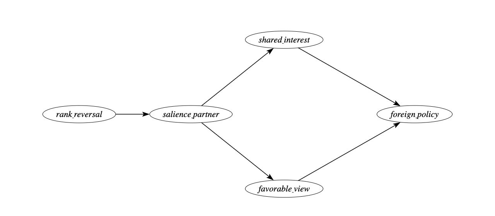
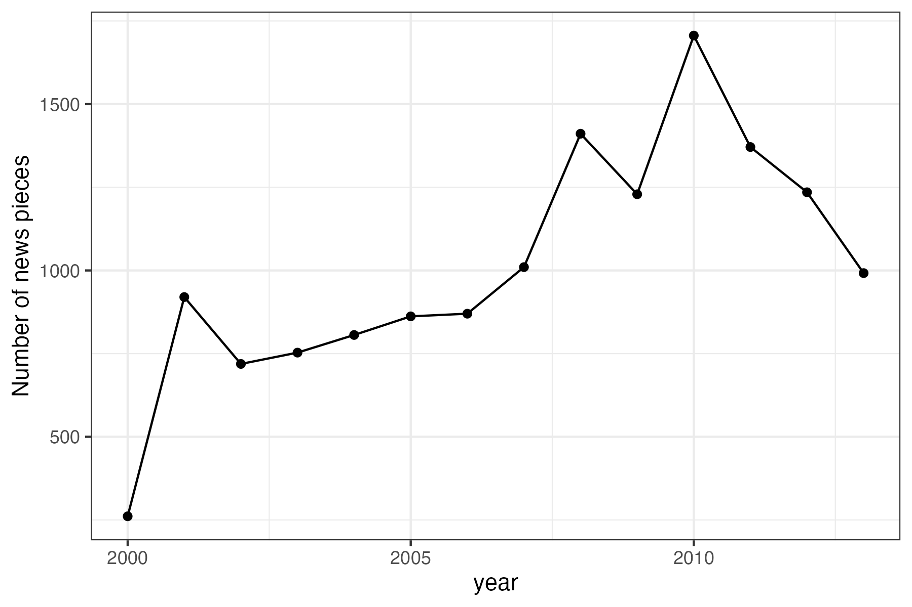
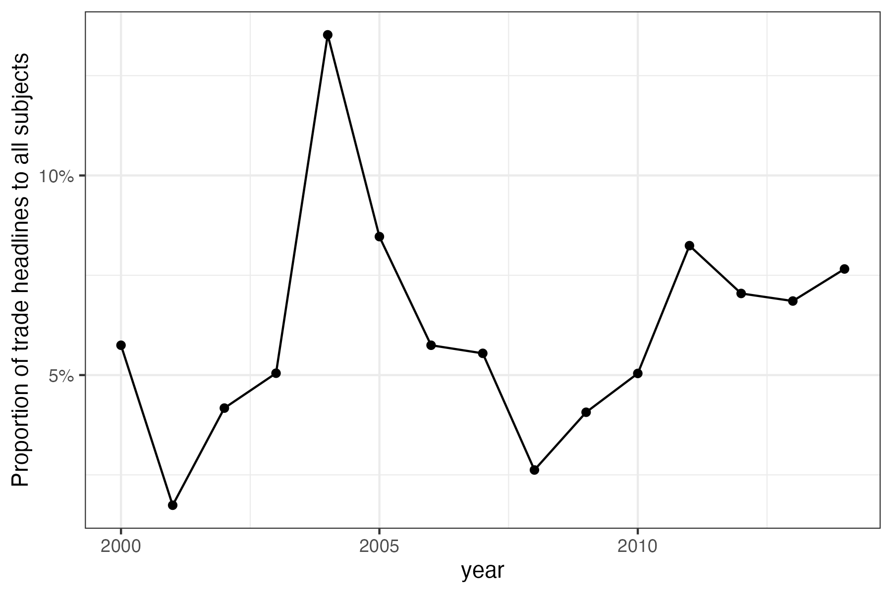

\pagebreak

```{r setup, include = FALSE}
library(tidyverse)
library(targets)
knitr::opts_chunk$set(echo = FALSE)
```


Word count: `r as.integer(sub("(\\d+).+$", "\\1", system(sprintf("wc -w %s", knitr::current_input()), intern = TRUE))) - 20`


# Introduction

"China overtakes US as Brazil's top trade partner". That was a headline in many Brazilian newspapers in 2009 [@rodrigues2009]. The BBC ran a similar headline in 2021, when China surpassed the United States as the EU's biggest trading partner [@bbc2021]. Sensing the symbolic weight of the milestone in Brazil, President Lula da Silva promptly announced a high-profile trip to Beijing, flanked by an unusually large business delegation. 

Should a status change induced by discrete rank reversals in trade hierarchies involving great powers cause disproportionate shifts in foreign policy alignment, beyond what gradual trade accumulation would predict? 

The status literature [@renshon_2016; @wardLostTranslationSocial2017; @dafoe_etal2014] focuses almost exclusively on status deficits and conflict. There is no theory predicting that a state gaining trade-based status would receive diplomatic concessions. The literature on status effects of rank changes exists in domestic politics [@anagol_fujiwara2016; @fujiwara_sanz2020] but has never been extended to international politics.

An extensive empirical literature shows that as a country’s trade dependence on China accumulates, its UN-voting distance from Beijing tends to fall [@kastner_pearson2021; @yan_zhou2021; @morgan_2019; @flores-macias_kreps2013], the same being true for Brazil and China in particular [@neto_malamud2015; @mouron_urdinez2014]. Analysts interpret this association in three ways: coercive leverage, i.e., China rewards or punishes to shape votes [@tanner_2007; @reilly2013], interest redefinition (growing commerce makes cooperation intrinsically valuable), and societal pressure (business lobbies or public opinion pull leaders toward Beijing). What these perspectives share is the assumption that influence scales smoothly with commercial exposure: the more trade, the more alignment — no particular trade share or moment is distinguished from another.

Research in cognitive psychology and political communication, by contrast, emphasizes that actors respond disproportionately to salient thresholds—events that break routine patterns and become focal in media and politicians' agendas [@baekgaard_etal2019; @sheffer_etal2018; @edwards_wood1999; @mintz_geva1997]. That is why countries routinely look for marks and milestones such as the Olympics to climb the ladder of status in world politics [@mercer_2017]. While most studies of status emphasized how lacking status drives risk-acceptant behavior and conflict, there is only anecdotal evidence that status yields tangible diplomatic dividends [@gotz_2021]. As a result, we know surprisingly little about the downstream effects when a state’s status actually rises.


```{r basic num, include = FALSE}
estimate <- round(tar_read(synth_fit)[1],2)
mean_br <- tar_read(synth_data) %>%
     filter(iso3c == "BRA", year < 2009) %>%
     summarise(mean_abs = round(mean(abs_distance_china), 2)) %>%
     pull(mean_abs)
perc_change <- abs(round(1 - (mean_br - estimate)/mean_br,2)*100)
sample_size_countries <- tar_read(synth_data) %>%
  summarise(num_countries = n_distinct(iso3c)) %>%
  pull(num_countries)
```

To generate our theory on the effect of sudden status change in trade hierarchies involving the hegemon, we focus on the most likely case: Brazil. The US was Brazil’s top trade partner for approximately 80 years, making the displacement maximally salient; Brazil has a free press (media channel can operate); Brazil is a regional power, not a small state, which rules out coercion. Most-likely cases are well-suited for theory generation with confirmatory value: if the effect doesn’t appear here, it’s unlikely to appear anywhere.

We use a synthetic difference-in-differences approach to estimate the causal effect of China becoming the first, as opposed to second, trade partner for Brazil on foreign policy orientation, measured as the absolute distance in UNGA ideal point estimation [@bailey_etal2017] between Brazil and China over 1997-2015. We show that this jump in economic status caused a 42% reduction in Brazil’s ideological distance from China in UNGA votes.

We complement this analysis with a Large Language Model analysis of Folha de São Paulo headlines to demonstrate the media’s role in publicizing, and thus legitimizing, this newfound status. By foregrounding both the quantitative effect and the salience channel, this study illuminates how status gains reshape foreign policy. It also has broad implications for the study of economic ties with an emerging power and the foreign policy of countries. Similar status change effects may be important for the impact of other economic variables (such as Foreign Direct Investment, aid, and loans) on the foreign policy of countries.

We then test the theory using a cross-country difference-in-differences regression on all countries where the United States was the top trade partner, comparing those where China eventually displaced the US with those where it did not.

The rest of the paper is organized as follows. Next, we discuss the importance of salience effects in the realm of trade effects and political alignment. In the third section, we present our methodology, data, and variables. Then, we present our empirical results. The fifth section discusses some robustness checks. The sixth section highlights evidence from the media, demonstrating the qualitative changes in coverage that occurred when China surpassed the US in 2009. In the seventh section, we move beyond the Brazilian case and present cross-country evidence using a heterogeneity-robust staggered difference-in-differences design on all countries where the US was the top trade partner. Finally, the last section offers our concluding remarks and summarizes key takeaways.

# Trade and Political Alignment

The analysis of the impact on the foreign policy of Brazil of China becoming its first trade partner builds on the literature on trade and foreign policy, behavioral science, and status theory in world politics. Many studies have studied the effect of trade with China on foreign policy. A strand of the literature argues that the trade effects are due to China's coercive capacity to threaten countries into behaving in the ways China wants [@tanner_2007; @reilly2013]. Other studies suggest that deepening economic ties create vested interests in which economic groups would lobby on behalf of China due to their self-interest [@kastner_pearson2021]. Another argument is that economic integration can transform public and elite opinion about China, either through soft power [@morgan_2019] or by influencing the way media report on China, thereby changing public perceptions [@kastner_pearson2021]. Finally, there is the dimension of structural power. China's diplomatic inroads into Latin America opened up the possibility of more autonomy from the US in the region [@struver_2014]. @schenoni_leiva2021 argue that recent changes in Brazilian foreign policy are the result of the pull of China as a new great power, leading to what they term "dual hegemony". According to the pioneering work by @neto2011, as Brazil became a more powerful country, it could distance itself from the US. It is thus expected that as China emerged as an important country, it would attract some alignment of Brazilian foreign policy due to this power effect. @mouron_urdinez2014 argued that the power gap was the most important factor, and that it was true for the broader South American countries: the smaller the power gap between a country and the US, the less it aligned with the US at the UN.

Qualitative studies echo these findings. For instance, @guilhon2014 notes trade was central to Brazil's foreign policy under Lula, while @vadell_2011 shows China's diplomacy in South America followed its economic interests.

These studies demonstrate that trade significantly impacts the foreign policy of a country like Brazil. Some of the mechanisms proposed in the literature for small states, such as coercion and threats, are not applicable to Brazil. There is no evidence in the literature on the relationship between the two countries of such measures by China [@haibin_2010; @urdinez_2014; @urdinez_etal2016; @brun_covarrubias2024], nor is Brazil dependent on foreign aid or loans from China like smaller and poorer countries.

Other studies have emphasized the reverse causal order. They contend that complementarity of aligned national interests and shared identities with the emerging discourse [@haibin_2010] and a revisionist stance towards the international order promoted more trade links between countries [@coutinho_rodriguez2024]. Numerous studies have found evidence that political alignment (or its absence) can have a significant impact on trade flows. Countries that bucked China's political preferences suffered subsequent trade declines [@fuchs_klann2013]. Countries that voted in support of the PRC (political alignment) in 1971 on the matters of Taiwan enjoyed a surge in bilateral trade with China in the immediately following year [@yan_zhou2021]. In a more general quantitative study, @chen_zhou2021 shows that a country tends to import more from partners with whom it has friendly relations, which is especially true for authoritarian states (such as China). Studies have found a similar effect in other economic variables, such as foreign direct investment [@aiyar_etal2024].

The most similar study to ours in terms of causal ambition is the pioneering quantitative study of @flores-macias_kreps2013. They show that the more countries trade with China, the more likely they are to side with China on foreign policy, as measured by vote similarity at the UNGA. To control for endogeneity, the authors employed two distinct approaches: a fixed-effects model with lagged variables and two-stage least squares. The first model is invalid from a causal point of view, since one key identification assumption in fixed effects models is no carryover effects, which precludes the use of lagged dependent variable in the regression [@blackwell_glynn2018; @imai_kim2019; @imai_kim2021]. The instrument used in the latter approach is the lagged energy production of a country. This variable, however, fails to meet the exclusion restriction assumption needed for a valid instrument, since energy production is, for example, related to economic development, which may be a causal pathway from the instrument to the outcome (political alignment). In general, it is very hard to justify the exclusion restriction of instruments [@mellon_2021; @bastardoz_2023; @lal_etal2024], and this is no exception, diminishing the credibility of the assumptions needed for causal identification.

Current quantitative studies measure Brazil's foreign policy alignment using UNGA vote similarity [@neto2011; @flores-macias_kreps2013; @mouron_urdinez2014], but as @bailey_etal2017 shows, this is problematic: changes in agenda and policy can't be separated. @bailey_etal2017 offers an improved metric using ideal point estimation, enabling us to focus on genuine shifts in state preference for this paper. By using their estimates, we measure only state preference reorientation over time, which is crucial for the paper's purpose.

While important, the idea that economic ties with China can alter the perception and beliefs of political elites often overlooks how decision-makers process information about economic relationships. Recent work in cognitive and behavioral sciences suggests that the salience of economic ties — not just their material depth — influences attention and policy choices [@enke2024]. The role of cues and heuristics in making foreign policy decisions has also been discussed in international relations [@jabarian_sartori2024]. Mechanisms include how redundant pieces of information nonetheless work by shifting one's attention [@conlon2023], whereby people neglect the correlated structure of information and treat them as independent [@enke_zimermann2017], or the importance of coarse categorization alongside granular information by news organizations in helping people decide what to pay attention to [@graeber_etal2025].

A similar and older approach in International Relations is poliheuristic theory [@mintz2004; @mintz_2005]. Due to information-processing constraints, poliheuristic decision-making process is based on a non-exhaustive search in the sense that “comparisons of policy options are made within a (very) restrictive alternative set and attribute set” [@mintz_geva1997, 84]. Consequently, policy dimensions or issues that attract attention may newly enter decision-makers’ consideration sets, even if they were previously ignored.

The status effect of rank changes is not new in the political science literature and has been documented in domestic politics before [@anagol_fujiwara2016; @folke_etal2016; @granzier_etal2023]. It helps to coordinate decisions and produce a bandwagon effect on voters who want to vote for the winner. However, as far as we know, no one has discussed status effects in international politics, although they could be just as likely to be real, as argued above. There is ample consensus that status, understood sometimes as the position or rank in a hierarchy, matters for world politics. Yet, there is no quantitative study estimating how a positive status shock translates into concrete policy concessions, voting behavior, or political alignment.

The idea that status matters has been extensively studied in international relations in the last fifteen years [@dafoe_etal2014; @miller_etal2015; @renshon_2016;  @renshon_etal2018; @duque_2018; @parlar_2019; @gotz_2021; @roren_2024]. A standard definition of status in the literature is the ranking or relative standing of a state [@macdonald_parent2021]. The definition conflates a continuous measure (relative standing) with an ordinal (thus, qualitative), namely, ranking. Being the first is different from being the second. As the saying goes, the second can be seen as the first loser. This ambiguity is problematic because it obscures the difference between a qualitative change and a smooth process. If we are talking about a continuous measure, it wouldn't matter if the Chinese Olympic team was the first in the medal count during the Beijing Olympics in 2008; what would matter is the number of medals relative to other countries. However, if the rank is what is important, then being the first at home is of ultimate importance. Our argument is that being the first or the second is what people pay attention to, due to information-processing constraints. As a result, status should be viewed primarily as a qualitative concept, more accurately captured by the notion of rank.

We draw on the notion of coarse categorization — the tendency to rely on broad, easily processed bins rather than fine-grained metrics when confronting complexity [@graeber_etal2025]. We argue that China becoming Brazil's first trade partner or overtaking the US are coarse categories that are often easier to process or require less mental effort than granular information. Even though decision-makers specialized in trade know the specific volume of trade and how to put them into context, their job is easier when communicating with parliamentary representatives, asking for funding for an initiative, or even selling it from a marketing perspective. As a result, we hypothesize that either directly or indirectly, such coarse news is important in driving momentum to produce changes in the foreign policy of a country like Brazil.

This contrasts with most theorizations of the link between trade and foreign policy, which often overlook qualitative changes in the status of a trade relationship. If decision-makers, business interests, and public opinion are fully rational, then indeed what matters is the level, or perhaps the speed, of change in the trade ties between countries, or even the expectation of future gains. Thus, a rank change, such as China becoming Brazil's top trade partner in 2009, overtaking the US, constitutes a prime example of a change in status that serves as a cue for policymakers to implement foreign policy changes. From the perspective of a coarse categorization rule, Brazil's case provides the ideal setting to test our theory, since being the first or second trade partner is a coarse categorization of an otherwise continuous variable observable by everyone. If there is no effect of such a rule, we shouldn't observe an effect any different from other close years when Brazil experienced trade growth with China. On the other hand, if rank matters and leaders look at coarse categories, then we should find an effect exactly when the change occurs. The salience of China's new status triggers the media, decision-makers, and business interests to focus on China, leading to an alignment in foreign policy. It facilitates the realization of the convergence of interests and the adoption of a more favorable view towards the foreign partner, which is self-serving.

The status-salience mechanism we propose operates under specific scope conditions. First, the displaced partner must be the hegemon or a geopolitically significant power---displacing a minor trade partner lacks the symbolic weight to trigger disproportionate attention from media and policymakers. Second, a free or active press is necessary for the media amplification channel to operate; in countries with restricted press freedom, the status change may go unreported or underreported, muting the salience mechanism. Third, the duration of the prior relationship matters---the longer the displaced partner held the top position, the more salient and symbolically disruptive the reversal becomes. Finally, democratic accountability may moderate the effect, as media salience is more consequential where public opinion constrains foreign policy choices. These conditions imply that the status effect should be strongest in democracies with a free press, where the hegemon held the top trade position for a long time, and where the rising power is perceived as geopolitically significant. In the cross-country analysis, we test the first scope condition directly by comparing specifications that restrict treatment to cases where China displaced the United States.

The causal claim of the present paper can be summarized by the simplified Directed Acyclic Graph (DAG)—a diagram that visually represents assumed causal relationships—below. We represent the main variables and proposed mechanisms, without any confounding variables, to clarify the argument. We discuss the identification strategy in the next section.

```{r dag-figure, echo=FALSE, fig.cap="Simplified DAG of the causal relationship between China's status as top trade partner and foreign policy alignment.", fig.pos="H", out.width="80%"}

```

Our empirical evidence and research design cannot adjudicate between the mechanisms of change in favorable views of China and the notion of shared interests. That said, we provide credible evidence that a salience effect exists and that it triggers a causal change in Brazil's foreign policy.

# Methodology

## Brazilian Case

We now explain how we will explore a discontinuity in Brazil's trade partner shift—from the US to China—to estimate the (local) causal effect of China's increased importance as Brazil's top trade partner. While we have a discontinuity, it might seem feasible to use a Regression Discontinuity Design. However, our data are a time series around a discontinuity, making this design inadequate.

A better alternative is the difference-in-differences (DiD) methodology. The key identification assumption in DiD is the so-called parallel trends assumption. This states that, absent the intervention, the treated unit (Brazil) would behave just as the average of the control group of countries. This assumption is not credible here. Many things happened during this period—such as the 2008 economic crisis and its subsequent effects—which undermine the credibility that countries would respond in the same way to this shock. This leads to bias in estimating the causal effect.

To avoid these problems, we employ the recently developed synthetic difference-in-differences (SDiD) method [@arkhangelsky_etal2021]. This method combines the DiD estimator with the synthetic control method (SCM), offering more flexibility than either method alone. DiD methods are not well-suited for a single treated unit because they inflate the standard error. SCM tries to match the pre-treatment trend in the outcome using covariates to estimate the counterfactual outcome. However, it compares the whole period before and after the intervention and does not allow for unit fixed effects. This can cause bias, especially if relevant time-invariant or slowly changing variables are omitted. SDiD attempts to address both problems: improving the adjustment for non-parallel trends in DiD and addressing the lack of time weights and fixed effects in SCM. By combining the two methods, SDiD enhances the ability to estimate causal effects. Similar to the SCM model, we estimate the causal effect by comparing the post-treatment behavior of the synthetic control and the treated unit, but with additional robustness. The specific model is as follows:

Consider a complete panel^[sometimes called a balanced panel. We prefer the term "complete" to avoid confusion with balancing of covariates, which is a standard analysis in causal studies]: $N$ countries measured over $T$ years, the outcome variable for country $i$ in time $t$ is $Y_{it}$ and the binary treatment variable $D_{it} \in \{0,1\}$. Suppose also that the first $N_{\text{countries}}$ do not receive the treatment and the last country $N_{\text{Brazil}}$ does receive the treatment at $t_0$. The job is, like in SCM, to find weights $\hat{w}^{\text{SDiD}}$ such that before $t_0$ treated and control countries match as closely as possible, that is, $\sum_{i=1}^{\text{countries}} \hat{w}^{\text{SDiD}}Y_{it} \approx \sum_{i=1}^{\text{Brazil}} Y_{it}$, for all $t = 1, ..., t_0$. Unlike SCM, we do not stop here. We then find $\hat{\lambda}^{\text{SDiD}}_t$ to balance the time trend before and after $t_0$. Lastly, the average causal effect on the treated $\tau_{ATT}$ is estimated by a two-way fixed effect regression model (as in standard DiD models):

$$
\bigl(\hat{\tau}_{ATT}^{\text{SDiD}}, \hat{\mu}, \hat{\beta} \bigr)
=
\operatorname*{arg\,min}_{\tau_{ATT},\mu,\beta, \alpha}
\sum_{i=1}^{N}\sum_{t=1}^{T}
\bigl(Y_{it}- \mu- \alpha_i - \beta_t-D_{it}\tau_{ATT}\bigr)^2\,
\hat{w}^{\text{SDiD}} \hat{\lambda}^{\text{SDiD}}_t
$$

In order to gain intuition, it is worthwhile to contrast it with both DiD and SCM. A DiD model estimates:

$$
\bigl(\hat{\tau}_{ATT}^{\text{DiD}}, \hat{\mu}, \hat{\lambda}, \hat{\beta}\bigr)
=
\operatorname*{arg\,min}_{\tau_{ATT},\mu, \alpha, \beta}
\sum_{i=1}^{N}\sum_{t=1}^{T}
\bigl(Y_{it}-\mu-\alpha_i -\beta_t-D_{it}\tau_{ATT}\bigr)^2
$$
As we can see, while SDiD assigns weights to the control group that are more similar to those of the treated unit and in time periods comparable to the pre-treatment period, classic DiD does not use any weights at all.

The SCM model can be written as follows:

$$
\bigl(\hat{\tau}_{ATT}^{\text{SCM}}, \hat{\mu}, \hat{\beta}\bigr)
=
\operatorname*{arg\,min}_{\tau_{ATT}, \mu, \beta}
\sum_{i=1}^{N}\sum_{t=1}^{T}
\bigl(Y_{it}-\mu-\beta_t-D_{it}\tau_{ATT}\bigr)^2\,
\hat{w}^{\text{SCM}}
$$
The equations show there is no unit fixed effect and no time weight. As a result, the SCM cannot use unit-specific unobserved invariant characteristics to approximate the counterfactual outcome. It must also consider the entire period when estimating the causal effect. This creates a problem for our data. The China-Brazil relationship becomes increasingly entangled over time. Years far removed from the treatment may not be suitable comparisons to periods long before the treatment.

Another key advantage of the SDID is that it reduces the variance of the estimator, allowing for more precise estimation [@arkhangelsky_etal2021]. However, a problem with the original application developed by @arkhangelsky_etal2021 is that it does not include time-varying covariates. These covariates are important for a more accurate match to the pre-treatment period. To address this, we include a vector of time-varying controls as suggested by @hirshberg_klosin2024. We now have the best of all worlds, without many of the problems of SCM and DiD in isolation. The estimated equation is now:

$$
\bigl(\hat{\tau}_{ATT}^{\text{SDiD}}, \hat{\mu}, \hat{\beta}, \hat{\gamma} \bigr)
=
\operatorname*{arg\,min}_{\tau_{ATT},\mu,\beta, \alpha, \gamma}
\sum_{i=1}^{N}\sum_{t=1}^{T}
\bigl(Y_{it}- \mu- \alpha_i - \beta_t-D_{it}\tau_{ATT} -X_{it}\gamma \bigr)^2\,
\hat{w}^{\text{SDiD}} \hat{\lambda}^{\text{SDiD}}_t
$$
## Cross-Country Design

Although the Brazilian case is a credible strategy to study the causal effect of status change, it is still $n=1$, and does not allow generalization beyond its specific features. Furthermore, we cannot rule out that the explanation resides in something specific to Lula da Silva's or the Workers' Party's presidency in the period considered, or rule out alternative explanations of potential confounders that happened at a similar time, such as the global economic crisis in the aftermath of Lehman Brothers' fallout and how the 2008 Beijing Summer Olympics changed China's status.

To address such challenges, we employ a difference-in-differences for all countries in our sample that had the US as their top trade partner, and consider the effect of China overtaking the US, inducing the discrete status change as we observed for Brazil, but in different time periods. As a result, there isn't a single time confounder like the Olympics or the Financial Crisis in 2008, which will allow us to test our theory more firmly and to generalize it beyond the Brazilian case.

## Data and Variables

```{r basic data, message=FALSE, warning=FALSE, echo=FALSE}
library(targets)
library(tidyverse)
df <- tar_read(synth_data)
num_countries <- df %>%
  summarise(num_countries = n_distinct(iso3c)) %>%
  pull(num_countries)

num_years <- df %>%
  filter(iso3c == "BRA") %>%
  filter( year < 2016) %>%
  summarise(num_years = n()) %>%
  pull(num_years)

min_year <- df %>%
  summarise(min_year = min(year)) %>%
  pull(min_year)

max_year <- df %>%
  filter( year < 2016) %>%
  summarise(max_year = max(year)) %>%
  pull(max_year)
```
 
To fit the model, current implementations of SDiD require a complete panel. Thus, we assemble a country-year panel that merges several datasets, covering `r num_countries` countries over `r num_years` years (`r min_year` - `r max_year`).  
Our outcome variable, vote similarity between a country and China at the United Nations General Assembly (UNGA), is based on ideal point estimates derived from UNGA vote data from @bailey_etal2017. We use the median estimate of the ideal points of each country per year and compute the absolute distance between China in a given year and each other country-year in the database. The lower the score, the closer the foreign policy between the countries. It measures state preferences apart from the agenda, which is important whenever a comparison is made over time, as is the case here. It is a better measure over time than raw similarity indices, such as the percentage of similar votes in a year [@neto_malamud2015], or any other measures, such as the S-score [@signorino_ritter1999]. 

UNGA vote affinity has been used as a measure of shared state preference in the literature due to its comprehensive membership coverage and the regular availability of data [@potrafke2009; @struver2016]. The topics covered by UNGA resolutions primarily focus on political dimensions, particularly humanitarian and social issues, with a small fraction of resolutions addressing economic and financial matters [@struver2016].

The treatment indicator $D_{it}$ equals 1 in the first year that China became Brazil's leading trade partner, in 2009, and in all subsequent years. Otherwise, it is zero for all country-years. Because the shock is plausibly exogenous to pre-trend voting behavior, it satisfies the parallel-trends assumption. The figure with the estimated model includes a pre-trend fit, which resembles the treated behavior of vote similarity, suggesting the assumption is valid.

Predictors include per capita GDP from the Gravity Database [@gurevich_herman2018]. Trade data are drawn from the International Trade and Production Database [@borchert_etal2021]. To avoid double-counting, we use the value reported by the importing country to compute total trade between two dyads, as importers have a greater interest in accurately measuring this value for tax collection purposes [@borchert_etal2021]. We compute the share of total trade with China and the share of total trade with the United States as our two measures of trade. As our measure of power, we used the Global Power Index (GPI) from the Pardee Institute at the University of Denver. GPI combines demographic, economic, military, technological, and diplomatic dimensions. We calculated the power gap between all countries and the US as the difference between their GPI indices. We also include distance to the US, as countries closer to the US will have a bigger incentive to align their foreign policy with it. Another economic variable is the exchange rate, since many countries complain about China's devalued currency. A country with a more devalued currency is expected to be more aligned with China than one with a less devalued currency. We also include per capita income, as reported by the World Bank. Table 1 presents the descriptive statistics.

A potential threat to our research design is the occurrence of a global economic crisis in 2008 [@frankel_saravelos2012]. It is possible that Brazil may react differently in its foreign policy than other countries due to the financial crisis. To rule out the possibility that Brazil’s alignment shift in 2009 was driven by macroeconomic turbulence rather than status salience, we augment our SDiD covariate matrix with two annual indicators capturing different facets of the 2008–09 crisis, all drawn from the Global Macro Database [@muller_etal2025]: a measure of current account balance (% GDP), to capture external‐sector stress and reliance on foreign financing; and a measure of Government Budget Deficit (% GDP), to reflect fiscal pressure and stimulus capacity.

With variables defined, we outline the estimation strategy next.

```{r table_summary, message=FALSE, warning=FALSE, echo=FALSE}
library(targets)
library(tidyverse)
library(gt)            # publication‑quality tables
library(gtsummary)  

tar_read(synth_data) %>% 
dplyr::select(-c(iso3c, year, hog_left)) %>%
tbl_summary(
    statistic = all_continuous() ~
      "{mean} ({sd}) [{min}, {max}]",   # Mean (SD) [Min, Max]
    digits = all_continuous()   ~ 2,
    label     = list(                 # rename variables for readability
      treatment   ~ "Treatment",
      abs_distance_china      ~ "Absolute ideal point distance to China",
      abs_distance_usa      ~ "Absolute ideal point distance to US",
      gpi   ~ "Power Index",
      us_power_gap   ~ "Power Gap to US",
      perc_trade_with_us  ~ "Share of trade with US",
      perc_trade_with_china  ~ "Share of trade with China",
      distance_us ~ "Physical distance to US",
      latin_america ~ "Latin America Country")
  ) %>% 
add_n() %>%                           # N column
modify_header(label ~ "**Variable**") %>%
modify_spanning_header(all_stat_cols() ~
     "**Descriptive statistics**") %>%
modify_caption("**Table 1.** Descriptive statistics of panel variables") %>%
bold_labels()


```


# Descriptive Analysis

In the figure below, we plot the evolution of the UNGA's ideal points for the US, Brazil, and China over time. As we can see, Brazil has been closer to China than to the US since the beginning of the data series, in 1990, up to 2022, during Bolsonaro's government. Although there is a distance between Brazil and China under Bolsonaro, it is still closer to China than to the US. This is a testament to how much Brazil is structurally aligned with China at the UNGA.

It also shows that Brazil is moving more over time than China, which is mostly stable over time. Thus, this indicates that Brazil is moving closer to China than the opposite, as expected, given the power asymmetry between the two countries.


```{r plot_unga1, message=FALSE, warning=FALSE, echo=FALSE, fig.cap= "Evolution of UNGA ideal points for the United States, Brazil, and China over time.", fig.pos="H"}
# library(ggplot2)
tar_read(plot_ideal)
```

Having established that it is mostly Brazil moving around rather than China, we can use as our main variable the absolute distance between Brazil's and China's ideal points, with the understanding that, apart from the beginning of the nineties, Brazil is almost always closer to the center than China and that Brazil is the one moving around.

```{r plot_unga2, message=FALSE, warning=FALSE, echo=FALSE, fig.cap= "Absolute distance between Brazil and China in UNGA ideal points over time.", fig.pos="H"}
# library(ggplot2)
tar_read(plot_ideal_distance)
```

The question one wonders after seeing the graphs is: why was Brazil getting closer over time? The main hypothesis discussed in the literature is the gravitational pull of the Chinese economy, as indicated by the percentage of Brazil's exports that went to China during the considered period. The figure below shows that around the year 2000, the percentage of exports destined for China increased at a roughly constant rate, exhibiting a steep variation that does not exactly align with the evolution of political alignment presented earlier, although there is some positive correlation.

```{r plot_trade, message=FALSE, warning=FALSE, echo=FALSE, fig.cap= "Share of Brazil's exports destined for China over time.", fig.pos="H"}
# library(ggplot2)
tar_read(trade_plot)
```


# Empirical Results

The graph below presents the evolution of political alignment between Brazil and China at the UNGA and among a donor pool of countries before and after China became Brazil's main trade partner. The counterfactual estimate from the donor pool allows us to estimate the causal effect of the treatment on the similarity of votes at UNGA. The estimate is −0.27 points, which means that becoming the main trade partner implied a decrease of 0.27 points in the absolute distance between the ideal points of Brazil and China after 2009. The result is statistically significant at the 5% level, allowing us to reject the null hypothesis of no change in the distance between the ideal points of both countries. The point estimate is `r sprintf('%1.2f', tar_read(synth_fit))` with a 95% CI of (`r sprintf('%1.2f, %1.2f', tar_read(synth_fit) - 1.96 * tar_read(se_synth), tar_read(synth_fit) + 1.96 * tar_read(se_synth))`).


```{r plot_sdis, message=FALSE, warning=FALSE, echo=FALSE, fig.cap= "The blue line shows Brazil's change from the weighted pre-treatment average to the post-treatment average. The red one does the same for synthetic control. The relative sizes of the time weights are at the bottom.", fig.pos="h"}
tar_read(plot_trend)
```

In Figure 6, we plot the results for Brazil, along with the top 10 controls, filtered by weight size. As we can see from the graph, no other country has a behavior similar to Brazil, which lends credibility to the estimation of the causal effect^[A figure with the weights for top controls is in the appendix].

```{r plot_parallel, message=FALSE, warning=FALSE, echo=FALSE, fig.cap= "10 controls with the largest weights", fig.pos="h"}
tar_read(spaghetti_plot)
```


# Robustness Checks

The target estimand of the SDiD estimator is the average treatment effect on the treated for the period post-treatment, whose weights are different from zero. This means that, in theory, it may be capturing the effect of other treatments that happened at a prior or later time. The main argument of the paper is that there is a distinctive quality in becoming the number one trade partner. If that is the case, then we should not find any effect when China became the second (in 2003, after overtaking Argentina and again in 2005, after briefly losing the second spot to Argentina in 2004), nor a few years after being the top one for a while.

Thus, we ran three placebo in-time tests, in which we pretended the true treatment happened in 2003, 2005, and 2012. For the first two placebo tests, we limit the sample data to the year 2008, in order not to include the effect of the true treatment that started in 2009. The table below presents the results for the three models, along with the original model for comparison. As we can see, the effects are smaller and not statistically significant at the conventional 95% level.


```{r table-placebo, message=FALSE, warning=FALSE, echo=FALSE}
library(knitr)

b_est0 <- tar_read(synth_fit)[1]          # placebo, treatment year 2003
se0    <- tar_read(se_synth)

b_est1 <- tar_read(placebo_teste_treatment02)[1]     # placebo, treatment year 2003
se1    <- tar_read(se_synth_placebo2)

b_est2 <- tar_read(placebo_teste_treatment04)[1]     # placebo, treatment year 2005
se2    <- tar_read(se_synth_placebo3)

b_est3 <- tar_read(placebo_teste_treatment11)[1]     # placebo, treatment year 2012
se3    <- tar_read(se_synth_placebo1)

placebo_tbl <- tibble(
  Model     = c("True model (2009)", "Placebo (2003)", "Placebo (2005)", "Placebo (2012)"),
  Estimate  = c(b_est0, b_est1, b_est2, b_est3),
  `Std. Error` = c(se0, se1, se2, se3),
  `95 % CI lower` = Estimate - 1.96 * c(se0, se1, se2, se3),
  `95 % CI upper` = Estimate + 1.96 * c(se0, se1, se2, se3)
)

kable(
  placebo_tbl,
  digits   = 2,
  caption  = "Synthetic DiD placebo tests and true treatment",
  align    = "lcccc"
)

```

A potential confounder is the Lula da Silva presidency (2003--2010), which pursued an explicit "South-South" foreign policy reorientation. However, Lula took office in 2003---six years before the treatment. If his ideology were driving alignment with China, the placebos at 2003 and 2005 should show significant effects; they do not. Moreover, the cross-country analysis (Section 7) shows that the effect is not specific to Brazil or to any single leader, as it appears across countries with different political systems and leadership ideologies. The staggered treatment timing across countries rules out any single-country political confounder.

## Salience in the media

If, as we argue, salience drives the causal effect of China's status change, there should be concrete evidence in Brazilian media coverage. To test this, we collected all headlines, stories, op-eds, and editorials mentioning "China" in Folha de São Paulo, Brazil's widest-circulation newspaper [@folha2016], from 2000 to 2014. Among 48,029 pieces, we identified 14,589 with "China" (or variants like "Chinese") in the headline, quantifying the evolution of China’s salience in national discourse. 

The stories encompass a wide range of themes, including sports, natural disasters, politics, economics, science, and more. However, over time, news pieces about China have increasingly reflected its growing relevance as Brazil's largest trade partner since 2009.

The evidence shows that, after 2009, Brazilian media attention to China not only increased but also shifted from general-interest stories to trade headlines. Figure 7 shows that news pieces about China peaked during the 2008 Beijing Olympics and remained high as China surpassed the US as Brazil’s largest trade partner. The shock year (2009) saw nearly twice the annual average of the pre-2008 period.


```{r plot_folha, message=FALSE, warning=FALSE, echo=FALSE, fig.cap= "Number of pieces published with term 'China' and variations in the headlines at newspaper Folha de São Paulo per year.", fig.pos="H", fig.asp = 0.8, fig.width = 7}




```

However, it is possible that China's rise in the news is due to events unrelated to trade, such as increased tensions with the US or the Beijing Olympics. To clarify whether trade-related news became more salient after 2009, we utilized the OpenAI API for ChatGPT, model gpt-4.1-mini, created on April 10, 2025, to categorize the news—see the appendix for details—into 10 categories. This step allows us to assess precisely how trade-focused news evolved over time.

This distinction is crucial because volume alone could reflect any China‑related event. What matters is the substance of what journalists discussed. To track this, Figure 8 plots the share of trade-economy pieces in all China headlines. The peak is in 2004, when there was less news about China in total and it was the year that both Brazil and China recognized China as a market economy at the WTO (14% of all trade-related stories that year), with mostly negative headlines. Manual reading of the trade news pieces at the time shows that a plurality of them are about soy import barriers put in place by China (38% of all trade-related stories that year). So, although it was a highly salient year, it was not the type of salience that would trigger pressure on foreign policy from the business community toward China.

```{r plot_folha2, message=FALSE, warning=FALSE, echo=FALSE, fig.cap= "Share of trade‑related items among all China headlines per year.", fig.pos="H", fig.asp = 0.8, fig.width = 7}



```

A closer look at the evolving themes further illustrates this shift. Up to 2006, the main China-related coverage focused on health issues, North Korea and nuclear topics, as well as certain sports themes ("seleção brasileira"). By 2009, those subjects remained, but news about Asia, the China and Hong Kong stock markets, and, centrally, Brazilian company Vale do Rio Doce’s exports to China—closely linked with the Dollar and Brazilian trade—became prominent. This evidence is central to our proposed mechanism, as it illustrates the qualitative transformation in the economic relationship between Brazilian companies, the broader economy, and China. It is helpful to zoom in and compare 2008 with 2009 for further clarity. 

A lexical snapshot emphasizes the qualitative break between years. By examining the most frequent trigrams, we gain insight into the changing content from year to year. Trigrams are strings of three tokens that help segment sentences into key phrases [@violos_etal2018]. In 2008, the most common three‑word bundles included ‘earthquake’, ‘Olympic torch’, and ‘bird flu’. In 2009, they shifted decisively to ‘record iron‑ore exports’, ‘Bovespa rises’, and ‘Brazil‑China trade hits record’—precisely the salience cues our theory predicts.

Headlines with "bate" ("reach") illustrate the pattern: In 2009, headlines like “Agribusiness exports reach record high, with China as the main highlight” and “China hits record iron ore imports” repeatedly appeared, while in 2008, “bate” appeared only once in an agribusiness context^[We used ChatGPT 4o to assist in the headlines translation from Portuguese into English. See https://chatgpt.com/share/6862b919-4630-800e-ab9c-df9dee5ae56c].


```{r trigram folha 08-09, message=FALSE, warning=FALSE, echo=FALSE, fig.cap= "Trigram of pieces published about China at newspaper Folha de São Paulo in 2008 and 2009. Only trigrams with co-occurrence frequency higher than 5 are shown.", fig.pos="H"}
library(patchwork)
lista_plot_08_09 <- tar_read(list_plots_08_09)
wrap_plots(lista_plot_08_09, ncol = 2) 
```

Political elite discourse mirrored the media. During his May 2009 visit to Beijing, President Lula opened a business seminar by noting that 'China has become, in 2009, Brazil's largest trading partner' and immediately linked this milestone to a coincidence of positions in international forums [@lula2009]. Two years later, Deputy Aldo Rebelo reminded the Foreign‑Affairs Committee that China's elevation to first place justified deeper legal cooperation [@camara2011].

Taken together, media salience shifted in both volume and content precisely when China overtook the United States. Figure 7 documents a sustained increase in China-related headlines after 2009. Figure 8 shows that the share of trade-economy stories doubled immediately following the rank change---a pattern absent in prior years---while the lexical comparison (Figure 9) confirms the pivot from disaster and sports trigrams in 2008 to 'record exports', 'iron ore', and 'Bovespa' in 2009. The timing aligns with the SDiD breakpoint (2009), and placebo years with similar trade growth but no rank change show no comparable media pivot. These patterns are consistent with a media agenda shock centered on the economic relationship, as predicted by coarse-categorization theories: once China became Brazil's largest partner, editors and readers re-sorted China stories into the 'top-trade-partner' category, amplifying their news value. This pattern is more consistent with a salience mechanism than with gradual interdependence.

# Cross-Country Evidence

The Brazilian case generates the theory, but it is a single-country study. A natural question is whether the same effect occurs when China displaces the United States as the top trade partner in other countries. Our theory predicts effects specifically when an emerging power displaces the hegemon---not when China overtakes Belgium or Singapore. This distinction is theoretically motivated: the status shock is most salient when the displaced partner is the incumbent great power, whose position in a country's trade hierarchy carries symbolic and geopolitical weight.

```{r did-displaced-usa-results, include=FALSE}
did_usa <- tar_read(did_displaced_usa)
att_usa <- did_usa$overall_att
att_est <- round(att_usa$overall.att, 3)
att_se  <- round(att_usa$overall.se, 3)
att_p   <- round(2 * pnorm(-abs(att_usa$overall.att / att_usa$overall.se)), 3)

es_data <- tar_read(event_study_data_usa)
n_treated <- dplyr::n_distinct(es_data$iso3c[es_data$first_treat > 0])
n_control <- dplyr::n_distinct(es_data$iso3c[es_data$first_treat == 0])
n_total <- n_treated + n_control
```

We test this prediction using all countries where the United States was the top export destination at some point in the sample period (`r n_total` countries). Among these, `r n_treated` eventually experienced China displacing the US as the top partner (treated group), while `r n_control` never experienced such a displacement (control group). This design ensures that treated and control countries share the same initial condition---having the US as their leading trade partner---and thus provides a more credible counterfactual than using all countries regardless of their trade structure. To estimate the causal effect across staggered treatments, we employ the heterogeneity-robust difference-in-differences estimator of @callaway_santanna2021. This method accommodates staggered treatment timing---countries entered treatment between 2002 and 2018---while allowing for treatment-effect heterogeneity across cohorts, a feature that standard two-way fixed effects regressions cannot guarantee [@imai_kim2021]. The outcome is the absolute distance to China in UNGA ideal points. The panel is balanced.

The overall ATT is `r att_est` (SE = `r att_se`, p = `r att_p`), indicating that countries where China displaced the United States moved significantly closer to China in UNGA voting. The event-study plot below displays the dynamic treatment effects with 95% confidence intervals. Pre-treatment estimates (e = −12 to e = −1) are statistically insignificant, supporting the parallel trends assumption. Effects build gradually after treatment, becoming significant at longer horizons.

```{r plot-es-displaced-usa, message=FALSE, warning=FALSE, echo=FALSE, fig.cap="Dynamic treatment effects: countries where China displaced the USA as top trade partner. Shaded area shows 95\\% confidence intervals. The dashed vertical line marks the treatment period.", fig.pos="H", fig.width=7, fig.asp=0.65}
tar_read(plot_es_displaced_usa)
```

```{r did-all-specs, include=FALSE}
library(dplyr)
# Full sample (all events, all controls)
did_full <- tar_read(did_results)
att_full <- did_full$overall_att

# Absorbing events only (all controls)
did_abs <- tar_read(did_absorbing)
att_abs <- did_abs$overall_att

# USA displaced, USA-was-#1 controls (main spec, already loaded as did_usa)
# did_usa loaded in chunk did-displaced-usa-results

# Absorbing + USA displaced (all controls)
did_abs_usa <- tar_read(did_absorbing_usa)
att_abs_usa <- did_abs_usa$overall_att

es_full <- tar_read(event_study_data)
ce <- tar_read(classified_events)

# Count treated units per spec
n_tr_full <- dplyr::n_distinct(es_full$iso3c[es_full$first_treat > 0])
n_co_full <- dplyr::n_distinct(es_full$iso3c[es_full$first_treat == 0])

abs_isos <- ce %>% dplyr::filter(absorbing == TRUE) %>% pull(iso3c)
n_tr_abs <- length(intersect(abs_isos, unique(es_full$iso3c[es_full$first_treat > 0])))

abs_usa_isos <- ce %>% dplyr::filter(absorbing == TRUE, displaced == "USA") %>% pull(iso3c)
n_tr_abs_usa <- length(intersect(abs_usa_isos, unique(es_full$iso3c[es_full$first_treat > 0])))

pval <- function(att) round(2 * pnorm(-abs(att$overall.att / att$overall.se)), 3)

spec_tbl <- tibble(
  Specification = c(
    "(1) All events, all controls",
    "(2) Absorbing events, all controls",
    "(3) USA displaced, USA-was-#1 controls",
    "(4) Absorbing + USA displaced, all controls"
  ),
  `N treated` = c(n_tr_full, n_tr_abs, n_treated, n_tr_abs_usa),
  `N control` = c(n_co_full, n_co_full, n_control, n_co_full),
  ATT = c(att_full$overall.att, att_abs$overall.att, att_usa$overall.att, att_abs_usa$overall.att),
  SE = c(att_full$overall.se, att_abs$overall.se, att_usa$overall.se, att_abs_usa$overall.se),
  `p-value` = c(pval(att_full), pval(att_abs), pval(att_usa), pval(att_abs_usa))
)
```

To test whether the status effect is specific to hegemon displacement---as our theory predicts---we estimate four progressively restricted specifications, reported in the table below. The full-sample specification, which includes all `r n_tr_full` events where China became the top export destination regardless of who was displaced, yields a null overall ATT (`r sprintf('%.3f', att_full$overall.att)`, p = `r pval(att_full)`). This is consistent with the theoretical expectation that when China displaces minor partners, there is no status shock large enough to shift foreign policy. Restricting to absorbing events---permanent displacements where China remained the top partner---moves the estimate toward a negative effect (ATT = `r sprintf('%.3f', att_abs$overall.att)`, p = `r pval(att_abs)`). Specification (3), the theoretically motivated restriction to cases where China displaced the United States with controls matched on the same initial condition, produces a significant effect. The absorbing-plus-USA specification shows a consistent sign but, with only `r n_tr_abs_usa` treated countries, lacks statistical power.

```{r table-did-specs, message=FALSE, warning=FALSE, echo=FALSE}
kable(spec_tbl,
      digits = 3,
      caption = "Cross-country DiD specifications: overall ATT estimates. Specification (3) is the theoretically preferred model.",
      align = "lccccc")
```

The cross-country effect (ATT = `r att_est`) is smaller in magnitude than the Brazilian SDiD estimate (−0.27), which is expected. Brazil's case is particularly strong: the United States had been its top trade partner for nearly eight decades, making the displacement by China an especially salient symbolic event. The cross-country finding nonetheless confirms that the status effect is not a Brazil-specific artifact. When China overtakes the United States---the hegemon---as the leading trade partner, it produces a detectable shift in foreign-policy alignment across a diverse set of countries.

# Conclusion

We have proposed a theory that the status change induced by trade rank reversal when China surpassed the US as the main trade partner of a country caused foreign policy realignment in that country. We found initial support for this effect when China overtook the US as the leading trade partner of a country like Brazil. The evidence is consistent with the idea that the symbolic significance of overtaking a historic trade partner prompted a substantive shift in diplomatic posture, beyond changes in trade volume. The cross-country regressions confirm the original finding, although with a smaller magnitude, which is expected, since Brazil is the most likely case.

Overall, the results suggest that we should look beyond the increasing trade ties between countries, as the literature has done so far [@yan_zhou2021; @flores-macias_kreps2013; @reilly2013], and also focus on qualitative shifts in the public perception of a trade partner's status. 

The results have broad implications for the literature on status. While it has focused on explaining how the search for status may trigger conflicts, it has overlooked robust empirical evidence that an increase in status changes the behavior of another country. Thus, contrary to @mercer_2017, who argued that prestige is illusory, we have shown that it matters in a realm important for a country like China, namely, voting in the UNGA.

Our study has some limitations that future research could investigate further. The cross-country analysis confirms that the status effect generalizes among countries where China displaced the United States, but we cannot yet test whether similar effects arise when China overtakes other partners (e.g., former colonial powers or regional trade leaders), as the number of such cases remains small and heterogeneous. Furthermore, we lack cross-country media data to verify whether the salience mechanism operates in the same way outside Brazil.

Secondly, the proposed mechanism has only indirect evidence. We have shown that newspaper coverage of trade ties with China shifted when it surpassed the US as the primary trade partner. However, we lack evidence on how business lobbies responded to it, and we do not have systematic data on the public or political elites. Qualitative studies with political and economic elites could attempt to recover their thinking at the time, for instance. Laboratory experiments could be conducted to provide evidence on the psychological and cognitive mechanisms underlying status based on a change in the rank of a partner.

Despite these limitations, our study is the first to provide evidence for such trade-status effects in international relations. By highlighting trade-status salience, this study also opens up new avenues for understanding how discrete milestones in economic ties can reshape international alignments and invites extensions to other domains (e.g., FDI, foreign aid, loans) and regions.

# References {-}

::: {#refs}
:::


# Appendix

We present more details about the performance and checks on the fitted model and how we used ChatGPT to perform the NLP analysis.

## SDiD

Below we present the weights for the top 10 controls used in the main model.

```{r plot_weigths, message=FALSE, warning=FALSE, echo=FALSE, fig.cap= "Weights of countries which contributed more to the construction of the synthetic control. The size of the dot represents the weight.", fig.pos="h"}
tar_read(plot_weights_coef)
```

We also fit a model for a donor pool of Latin American states (excluding Caribbean countries), which is more similar to Brazil than using countries worldwide. One reason to prefer a pool of Latin American countries is that a smaller donor pool helps avoid overfitting. When comparing results, the estimated causal effect is quite similar (a bit larger in absolute terms), which lends credibility to the main estimation. However, the small number of controls introduces noise and increases the uncertainty of the model. It is known that the usage of the placebo method to compute standard errors inflates the uncertainty of the estimation. For this reason, we prefer the model with the larger donor pool. Nonetheless, it is reassuring that with a donor pool composed of Latin American countries, which are arguably more similar to Brazil, the estimate is quite similar. Below is the plot of the model fitted for Latin America.


```{r plot latam, message=FALSE, warning=FALSE, echo=FALSE, fig.cap= "SDiD fit with Latin American countries. Bigger estimated causal effect, but inflates standard error", fig.pos="h"}
tar_read(plot_trend_latam)
b_est_latam <- tar_read(synth_fit_latam)[1]          # placebo, treatment year 2003
se_latam    <- tar_read(se_synth_latam)
```

The estimate is `r round(b_est_latam,2) ` with a standard error of `r round(se_latam,2) `. In any case, it is interesting to examine the countries with the largest weights. Argentina, Guatemala, Paraguay, and Uruguay, all but Guatemala are founding members of Mercosur. They contribute the most to synthetic control.

```{r plot weight latam, message=FALSE, warning=FALSE, echo=FALSE, fig.cap= "SDiD fit with Latin American countries. Bigger estimated causal effect, but worse pre-treatment fit", fig.pos="h"}
tar_read(plot_weights_coef_latam)
```

## Cross-Country DiD Robustness

With only `r n_treated` treated countries, asymptotic cluster-robust inference may be liberal. We address this concern with two finite-sample procedures.

```{r wild-bootstrap, include=FALSE}
wb <- tar_read(wild_bootstrap_result)
```

**Wild cluster bootstrap.** We stack the staggered treatments into a single DiD specification and apply the wild cluster bootstrap with Webb weights [@mackinnon_webb2018], using `r formatC(9999, big.mark = ",")` replications. The stacked DiD coefficient is `r sprintf('%.3f', wb$coef)` (cluster SE = `r sprintf('%.3f', wb$se_cluster)`) with a bootstrap p-value of `r sprintf('%.3f', wb$boot_p_value)` and 95% bootstrap CI [`r sprintf('%.3f', wb$boot_ci[1])`, `r sprintf('%.3f', wb$boot_ci[2])`], based on `r wb$n_clusters` clusters. The result remains statistically significant under this more conservative inference procedure.

```{r fisher-test, include=FALSE}
ft <- tar_read(fisher_test_result)
```

**Fisher randomization test.** To provide exact inference that does not rely on large-sample asymptotics, we randomly reassign treatment status across countries and re-estimate the overall ATT under each permutation. The observed ATT (`r sprintf('%.3f', ft$observed_att)`) is more extreme than `r sprintf('%.1f', (1 - ft$p_value) * 100)`% of the `r ft$n_valid` valid permutation estimates (Fisher p = `r sprintf('%.3f', ft$p_value)`).

```{r plot-fisher, message=FALSE, warning=FALSE, echo=FALSE, fig.cap="Fisher randomization distribution. The dashed red line marks the observed ATT.", fig.pos="H", fig.width=7, fig.asp=0.65}
tar_read(plot_fisher)
```

## ChatGPT Classification

Below is the coded instruction to the ChatGPT API to classify the subjects of the headlines.

```{r code chagpt, echo=TRUE, eval=FALSE}
system_block <- paste(
  'You are a Brazilian expert in International Relations and the political',
  'economy of China–Brazil relations.  Classify the subject of EACH headline',
  'whe I say EACH, I mean all of them, even if repetitive or similar. Do classify **all** of them',
  'using **one** label from this list exactly as written:',
  '"diplomacy", "chinese economy", "china-brasil relations",',
  '"disaster and accidents", "chinese politics and policy",',
  '"sports, science, culture, other", "human rights",',
  '"china-brazil trade", "health".\n\n',
  # 13 static few-shot examples — leave them unchanged!
  'Examples:\n',
  '1. Presidente chinês visita o Brasil e participa de reunião com FHC -> china-brasil relations\n',
  '2. Ministro chinês de Defesa faz visita oficial ao Brasil -> china-brasil relations\n',
  '3. Para governo, novo câmbio chinês só beneficia Brasil no médio prazo -> china-brazil trade\n',
  '4. China ultrapassa EUA como maior parceiro comercial do Brasil -> china-brazil trade\n',
  '5. China vai controlar preços de alimentos e combustíveis -> chinese economy\n',
  '6. Vendas de automóveis na China desaceleram em junho -> chinese economy\n',
  '7. China quer devolução das relíquias Yin, patrimônio da Unesco -> sports, science, culture, other\n',
  '8. Dinossauro encontrado na China esclarece origem das aves -> sports, science, culture, other\n',
  '9. OMS confirma mais de 4.600 casos de gripe suína; China registra 2º caso -> health\n',
  '10. Marinha chinesa busca "cansar" barcos japoneses em águas disputadas -> diplomacy\n',
  '11. Acidente após casamento deixa 16 mortos na China -> disaster and accidents\n',
  '12. Jornal chinês sai das bancas por foto da praça Tiananmen -> human rights\n',
  '13. China é parceira estratégica contra crise econômica, diz UE -> chinese economy',
  'return as in the examples, a string with the headline and the classification'
)

```

It is important to highlight that the process was not streamlined. We faced several problems, such as ChatGPT refusing to classify subjects (saying they were repetitive and too similar), changing the original headline, which made matching back to the original dataset difficult, and other similar problems. As a result, we had to rerun the instructions a few times on a sample and tweak it with some prompt engineering until arriving at that final version. As a result, this is the only part of the paper not fully reproducible, in the sense that another request for classification, with the same instructions, would yield a few different categorizations and a few different original headlines changed, along with some refusals to classify texts.

Below we provide a random sample of the headlines and the classification provided by ChatGPT.

```{r sample_chagpt, message=FALSE, warning=FALSE, echo=FALSE}
library(targets)
library(tidyverse)
library(gt)            # publication‑quality tables
library(gtsummary)  

knitr::include_graphics("images/table1_headlines.png")


```
