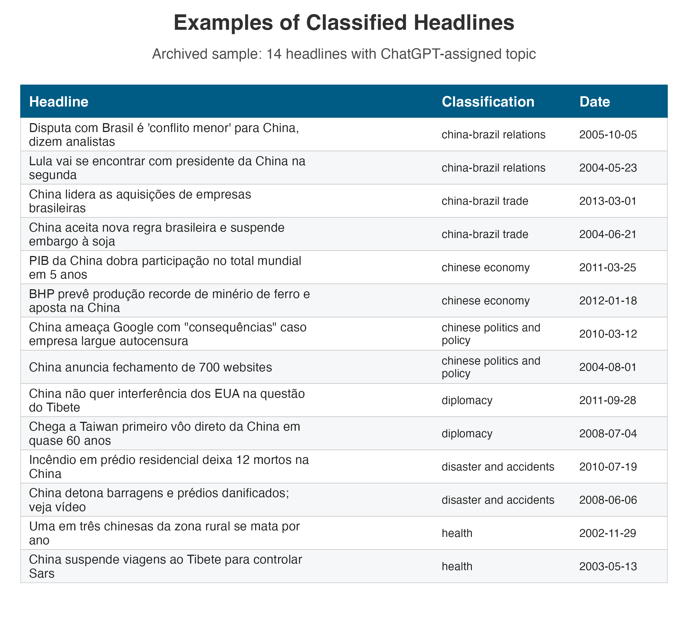

\pagebreak

```{r setup, include = FALSE}
library(tidyverse)
library(targets)
knitr::opts_chunk$set(echo = FALSE)
source(here::here("scripts", "functions.R"))

caption_note <- function(unit = NULL, se = NULL, cluster = NULL, window = NULL, treatment = NULL) {
  fields <- c(
    if (!is.null(unit) && nzchar(unit)) paste0("Unit = ", unit),
    if (!is.null(se) && nzchar(se)) paste0("Standard error = ", se),
    if (!is.null(cluster) && nzchar(cluster)) paste0("Cluster = ", cluster),
    if (!is.null(window) && nzchar(window)) paste0("Time window = ", window),
    if (!is.null(treatment) && nzchar(treatment)) paste0("Treatment definition = ", treatment)
  )
  if (length(fields) == 0) {
    return("")
  }
  paste0("Note: ", paste(fields, collapse = ". "), ".")
}

treat_def_brazil <- "Treatment indicator equals 1 from 2009 onward, when China becomes Brazil's top export destination displacing the USA, and 0 before 2009"
treat_def_panel <- "Treatment indicator equals 1 in any year China is currently the top export destination; turns off if USA regains the position (switching treatment)"

resolve_existing_file <- function(candidates) {
  hits <- candidates[file.exists(candidates)]
  if (length(hits) == 0) {
    stop("Missing file. Tried: ", paste(candidates, collapse = " | "))
  }
  hits[[1]]
}

word_count_text <- function(input = knitr::current_input(), subtract_n = 20L) {
  wc_raw <- system2("wc", c("-w", input), stdout = TRUE)
  wc_n <- as.integer(strsplit(trimws(wc_raw), "\\s+")[[1]][1])
  format(wc_n - subtract_n, scientific = FALSE, big.mark = ",", trim = TRUE)
}
```


Word count: `r word_count_text()`


# Introduction

"China overtakes US as Brazil's top trade partner". That was a headline in many Brazilian newspapers in 2009 [@rodrigues2009]. The BBC ran a similar headline in 2021, when China surpassed the United States as the EU's biggest trading partner [@bbc2021]. Sensing the symbolic weight of the milestone in Brazil, President Lula da Silva promptly announced a high-profile trip to Beijing, flanked by an unusually large business delegation. 

Do discrete rank reversals in trade hierarchies — particularly when a rising power displaces the hegemon — produce foreign policy realignment beyond what continuous trade growth predicts?

The status literature [@renshon_2016; @wardLostTranslationSocial2017; @dafoe_etal2014] focuses almost exclusively on status deficits and conflict. It offers limited theoretical guidance predicting that a state gaining trade-based status would receive diplomatic concessions. The literature on status effects of rank changes exists in domestic politics [@anagol_fujiwara2016; @fujiwara_sanz2020] but has never been extended to international politics.

An extensive empirical literature shows that as a country’s trade dependence on China accumulates, its UN-voting distance from Beijing tends to fall [@kastner_pearson2021; @yan_zhou2021; @morgan_2019; @flores-macias_kreps2013], the same being true for Brazil and China in particular [@neto_malamud2015; @mouron_urdinez2014]. Analysts interpret this association in three ways: coercive leverage, i.e., China rewards or punishes to shape votes [@tanner_2007; @reilly2013], interest redefinition (growing commerce makes cooperation intrinsically valuable), and societal pressure (business lobbies or public opinion pull leaders toward Beijing). What these perspectives share is the assumption that influence scales smoothly with commercial exposure: the more trade, the more alignment — no particular trade share or moment is distinguished from another.

Research in cognitive psychology and political communication, by contrast, emphasizes that actors respond disproportionately to salient thresholds -- events that break routine patterns and become focal in media and politicians' agendas [@baekgaard_etal2019; @sheffer_etal2018; @edwards_wood1999; @mintz_geva1997; @mercer_2017].

While most studies of status emphasized how lacking status drives risk-acceptant behavior and conflict, there is only anecdotal evidence that status yields tangible diplomatic dividends [@gotz_2021]. As a result, we know surprisingly little about the downstream effects when a state’s status actually rises.


```{r basic num, include = FALSE}
estimate <- as.numeric(tar_read(synth_fit)[1])
se_estimate <- as.numeric(tar_read(se_synth))
ci_low <- estimate - 1.96 * se_estimate
ci_high <- estimate + 1.96 * se_estimate
p_estimate <- 2 * pnorm(-abs(estimate / se_estimate))
mean_br <- tar_read(synth_data) %>%
     filter(iso3c == "BRA", year < 2009) %>%
     summarise(mean_abs = mean(abs_distance_china, na.rm = TRUE)) %>%
     pull(mean_abs)
perc_change <- abs(estimate) / mean_br * 100
sample_size_countries <- tar_read(synth_data) %>%
  summarise(num_countries = n_distinct(iso3c)) %>%
  pull(num_countries)

fect_ife_fit <- tar_read(fect_ife)
fect_summary <- fect_att_summary(fect_ife_fit)
att_cross <- fect_summary$att
se_cross <- fect_summary$se
p_cross <- fect_summary$p
r_cv <- fect_summary$r_cv
```

We argue that rank reversals deliver discrete status changes that, processed as coarse categories, trigger disproportionate media salience and foreign policy realignment, beyond what gradual trade accumulation predicts. We argue this is more likely when other cues increase salience, such as the former trade partner being the hegemon or the reversal overcomes a long-run historic pattern.

To develop and initially probe our theory, we focus on the most likely case: Brazil. The US was Brazil's top trade partner for approximately 80 years, making the displacement maximally salient. Brazil has a free press (media channel can operate); Brazil is a regional power, not a small state, which makes coercion unlikely. Most-likely cases are well-suited for theory generation with confirmatory value: if the effect doesn't appear here, it's unlikely to appear anywhere. We follow a structured hybrid approach: the reduced-form prediction (rank reversal → alignment) is tested in Brazil (SDiD) and cross-country (DiD), while the salience mechanism is proposed and probed using the Brazilian case and NLP media evidence.

To credibly show that the overtaking of the US by China as Brazil's top trade partner has a causal effect on Brazil's foreign policy orientation, we use a synthetic difference-in-differences approach. We measured the outcome as the absolute distance in UNGA ideal point estimation [@bailey_etal2017] between Brazil and China over 1997-2015. The SDiD point estimate corresponds to an estimated `r sprintf('%.1f', perc_change)`% reduction in Brazil’s ideological distance from China in UNGA votes.

As Brazil is a single case, we test the theory that status change impacts foreign policy using a cross-country design on all countries where the United States was the top trade partner. We compare those where China eventually displaced the US (the treatment) with those where it did not (control group), using a counterfactual estimator with interactive fixed effects [@liu2024practical] that accommodates treatment switching -- four of the eight treated countries see the USA regain the top position. The results are consistent with the case study, and exit-aligned analysis shows the effect dissipates when treatment turns off.

To illuminate the mechanisms behind the effect of status change, we perform a deep analysis of the Brazilian case, showing a plausible channel through which rank appears as a cue that may trigger change in policy making: the media’s role in publicizing, and thus legitimizing this newfound status.  

This study provides the first causal evidence that trade rank reversals produce foreign policy realignment, with suggestive evidence that a media-salience mechanism contributes to this effect. It questions the idea in the literature that status gains are mostly illusory [@mercer_2017]. It also has broad implications for the study of economic ties with an emerging power and the foreign policy of countries. Similar status change effects may also shape how other economic variables (such as Foreign Direct Investment, aid, and loans) impact the foreign policy of countries.

The rest of the paper is organized as follows. Section 2 presents the theoretical framework: we review the gradualist consensus in the trade-alignment literature, develop the status-salience argument grounded in coarse categorization and punctuated equilibrium, derive four testable hypotheses, specify scope conditions, and systematically address alternative explanations. Section 3 describes our methodology, data, and variables. Section 4 presents the empirical results and robustness checks for the Brazilian case. Section 5 provides media-based evidence on the qualitative shift in coverage after China surpassed the US in 2009. Section 6 moves beyond Brazil with cross-country evidence using counterfactual estimators that accommodate treatment switching. Section 7 concludes.

# Trade, Status, and Political Alignment


An extensive literature examines how trade with China affects foreign policy. The proposed mechanisms vary -- coercive leverage, where China rewards or punishes to shape votes [@tanner_2007; @reilly2013]; interest redefinition, where deepening economic ties create vested interests that lobby on behalf of Beijing [@kastner_pearson2021]; soft power and societal pressure, where economic integration transforms public and elite opinion [@morgan_2019; @kastner_pearson2021]; and structural power, where China's rise as a great power pulls countries toward its orbit [@struver_2014; @schenoni_leiva2021; @neto2011; @mouron_urdinez2014]. What these perspectives share is the assumption that influence scales smoothly with commercial exposure: the more trade, the more alignment -- no particular trade share or moment is distinguished from any other.

Yet the empirical record shows reality is more messy. Reverse causality remains a concern: political alignment may drive trade rather than the reverse [@haibin_2010; @coutinho_rodriguez2024; @fuchs_klann2013; @yan_zhou2021; @chen_zhou2021; @aiyar_etal2024]^[The most ambitious causal study in this tradition, @flores-macias_kreps2013, employs fixed-effects with lagged dependent variables and two-stage least squares. Both strategies face well-documented identification problems: the lagged dependent variable violates the no-carryover assumption required for FE consistency [@blackwell_glynn2018; @imai_kim2019; @imai_kim2021], and the instrument (lagged energy production) likely fails the exclusion restriction [@mellon_2021; @bastardoz_2023; @lal_etal2024].]. More substantively, if gradual trade growth consistently produced alignment, we should observe a monotonic relationship. Instead, @carmody_etal2020 find the opposite for Africa: countries that increased trade with China voted *more* with the United States, not less -- consistent with hedging rather than bandwagoning. @garcia_herrero_etal2024 show that UNGA alignment with China has remained remarkably stable despite China's dramatic economic rise, suggesting that continuous trade growth alone does not move the needle on foreign policy. If gradual trade growth does not consistently produce alignment, what does?

## Why Rank Reversals Matter

Status has been extensively studied in international relations [@dafoe_etal2014; @miller_etal2015; @renshon_2016; @renshon_etal2018; @duque_2018; @parlar_2019; @gotz_2021; @roren_2024]. A standard definition is the ranking or relative standing of a state [@macdonald_parent2021]. This definition, however, conflates a continuous measure (relative standing) with an ordinal one (rank position). Being first is qualitatively different from being second, and that distinction matters for how actors process information and allocate attention. We distinguish between *trade status* -- the ordinal position of a trade partner in a country's hierarchy of commercial relationships -- and *status shock* -- the discrete event of a rank reversal. In an experimental setup, status is the treatment; rank reversal is the manipulation. Our argument concerns the downstream consequences of status shocks, not status seeking, status anxiety, or military conflict -- the phenomena that dominate the existing IR status literature.

The micro-foundation for why rank matters comes from coarse categorization -- the tendency to rely on broad, easily processed bins rather than fine-grained metrics when confronting complexity [@graeber_etal2025; @enke2024]. Actors -- media editors, policymakers, business leaders -- attend to categories like "top trade partner" as well as tracking continuous trade shares. The relevant categories here are "US = top partner" (a cognitive default entrenched by decades of commercial primacy) versus "China = top partner" (a disruptive reclassification). The rank reversal does not bring new information about trade volumes -- those data are continuously available. What it brings is a *categorical reclassification* that captures attention precisely because it disrupts an entrenched bin. Even redundant information shifts attention when it alters salient categories [@conlon2023; @bordalo_etal2022], and people tend to neglect the correlated structure of information and treat novel framings as independent signals [@enke_zimermann2017].

The effect of rank on political decisions is well documented in domestic politics. Rank reversals produce bandwagon effects in elections [@anagol_fujiwara2016; @granzier_etal2023], regression discontinuities at the boundary of winning versus losing affect subsequent political careers [@folke_etal2016; @fujiwara_sanz2020], and similar rank-based thresholds coordinate behavior across diverse actors. The rank reversal functions as focusing event by breaking entrenched cognitive category. Yet no study has examined whether rank effects operate in international politics, despite the plausibility that they do. Status is widely acknowledged to matter in world politics, but there is no quantitative study estimating how a positive status shock translates into concrete policy changes or political alignment.

## Two Claims: Attention and Policy Response

Our theory rests on two distinct claims. *Claim 1 (Attention)*: A rank reversal produces a disproportionate increase in media salience. The micro-foundation is coarse categorization: the reclassification from "second partner" to "first partner" triggers a categorical reframing in news coverage. The amplification occurs through agenda-setting [@edwards_wood1999] -- the media transforms the categorical reclassification into a focal event for national attention. Since this a bounded rounality reaction, it is plausible that it would be temporary: as the new status becomes the cognitive default, salience fades. We provie evidence for this claim directly using NLP analysis of Brazilian newspaper coverage.

*Claim 2 (Policy Response)*: The salience shock translates into foreign policy realignment through complementary channels. First, a cognitive channel: poliheuristic theory [@mintz2004; @mintz_geva1997; @mintz_2005] predicts that decision-makers use non-exhaustive search heuristics, and the salience spike causes the new trade status to enter their consideration sets, even if the underlying economic relationship was previously discounted. The role of cues and heuristics in foreign policy decisions has been discussed in international relations [@jabarian_sartori2024]. Second, an audience cost channel: once the media publicizes the new status, leaders face reputational incentives to align discourse and action with the newly salient relationship [@fearon1994; @tomz2007]. Third, a coordination channel: the rank reversal creates a focal point in the Schelling sense around which business lobbies, diplomats, and public opinion coordinate their demands for policy adjustment. These channels are complementary, and our design does not distinguish among them. The SDiD identifies their combined reduced-form effect.

We are explicit about the limits of our design. The SDiD estimates the combined reduced-form effect of the rank reversal on alignment through all channels. The NLP media analysis provides suggestive evidence for Claim 1 (attention). Claim 2 -- how salience translates into votes -- is theorized but not causally identified. We provide convergent evidence consistent with an attention channel, while acknowledging that the policy response channel remains theorized rather than directly identified.

## Hypotheses

From the theoretical building blocks above, we derive four testable hypotheses.

The first hypothesis is the main effect of interest and is related to the reduced-form specification.

Hypothesis 1 (Main Effect): Rank reversals -- where China displaces the incumbent top trade partner -- produce a discrete reduction in UNGA voting distance from China, beyond what gradual trade growth predicts. This follows from coarse categorization (the rank reversal is a category disruption) that opens a window for policy change.

Our theorization also makes predictions about mechanisms, which we specify here the one we can test or provide evidence concistent with in the paper. 

Hypothesis 2 (Hegemon Moderation): The effect is larger when an emerging power displaces the hegemon, compared to when the displaced partner is any other country. Coarse categorization theory predicts that disrupting a more entrenched cognitive category, and "US = top partner" is among the most deeply entrenched, produces a larger attention shock [@graeber_etal2025].

Hypothesis 3 (Media Salience): Media coverage of the trade relationship increases disproportionately at the moment of the rank reversal, rather than tracking gradual trade growth. This is the direct observable implication of Claim 1 and is testable with the NLP analysis.

Hypothesis 4 (Temporal Attenuation): The alignment effect attenuates over time as the new status becomes the cognitive default. Salience is by nature temporary -- the new rank normalizes and media attention shifts to other topics. This hypothesis is particularly discriminating: structural bandwagoning, coercion, and interest-group theories all predict *persistent* effects. Only a salience mechanism uniquely predicts transience.

## Scope Conditions

The status-salience mechanism operates under conditions that follow from the theoretical building blocks above. First, the displaced partner must be geopolitically significant, ideally the hegemon. Coarse categorization theory predicts that disrupting a more prominent cognitive category produces a larger attention shock. Second, the media amplification channel requires a free or active press; in countries with restricted press freedom, the rank reversal may go unreported, muting the salience mechanism. This follows directly from the agenda-setting literature [@edwards_wood1999]. Third, the duration of the prior relationship matters: the longer the displaced partner held the top position, the more entrenched the existing category and the more disruptive the reversal [@mintz_geva1997]. Fourth, democratic accountability moderates the effect, as media salience is more consequential where public opinion constrains foreign policy choices. Fifth, the rank reversal should be exogenous to deliberate trade diversification policy -- if a government actively pursued the rank reversal as part of a broader realignment strategy, the effect captures policy intent rather than the salience mechanism. In the cross-country analysis, we test scope condition 1 directly by comparing specifications where China displaced the United States versus any partner, and scope conditions 2 and 3 enter as covariates (press freedom and US streak).

## Causal Framework

The causal claim of the present paper can be summarized by the simplified Directed Acyclic Graph (DAG) -- a diagram that visually represents assumed causal relationships -- below. We represent the main variables and proposed mechanisms, without any confounding variables, to clarify the argument. We discuss the identification strategy in the next section.

```{r dag-figure, echo=FALSE, fig.cap=paste0("Simplified DAG of the causal relationship between China's status as top trade partner and foreign policy alignment. ", caption_note("conceptual diagram (no numeric scale)", "not applicable", "not applicable", "conceptual graph; treatment onset is 2009 in Brazil and country-specific in panel analyses", treat_def_panel)), fig.pos="H", out.width="80%"}
# Reproducible in-code DAG replacement for missing external asset.
op <- par(mar = c(0, 0, 0, 0))
on.exit(par(op), add = TRUE)
plot.new()
plot.window(xlim = c(0, 1), ylim = c(0, 1))

rect(0.08, 0.68, 0.40, 0.88, border = "black", col = "#f2f2f2")
text(0.24, 0.78, "Rank reversal\n(China overtakes US)")

rect(0.60, 0.68, 0.92, 0.88, border = "black", col = "#f2f2f2")
text(0.76, 0.78, "Media salience")

rect(0.34, 0.16, 0.66, 0.36, border = "black", col = "#f2f2f2")
text(0.50, 0.26, "UNGA alignment\n(distance to China)")

arrows(0.40, 0.78, 0.60, 0.78, length = 0.08, lwd = 1.2)
arrows(0.24, 0.68, 0.42, 0.36, length = 0.08, lwd = 1.2)
arrows(0.76, 0.68, 0.58, 0.36, length = 0.08, lwd = 1.2)
```

# Methodology

## Brazilian Case

We now explain how we will explore a discontinuity in Brazil's trade partner shift—from the US to China—to estimate the (local) causal effect of China's increased importance as Brazil's top trade partner. While we have a discontinuity, it might seem feasible to use a Regression Discontinuity Design. However, our data are a time series around a discontinuity, making this design inadequate.

A better alternative is the difference-in-differences (DiD) methodology. The key identification assumption in DiD is the so-called parallel trends assumption. This states that, absent the intervention, the treated unit (Brazil) would behave just as the average of the control group of countries. This assumption is not credible here. Many things happened during this period—such as the 2008 economic crisis and its subsequent effects—which undermine the credibility that countries would respond in the same way to this shock. This leads to bias in estimating the causal effect.

To avoid these problems, we employ the recently developed synthetic difference-in-differences (SDiD) method [@arkhangelsky_etal2021]. This method combines the DiD estimator with the synthetic control method (SCM), offering more flexibility than either method alone. DiD methods are not well-suited for a single treated unit because they inflate the standard error. SCM tries to match the pre-treatment trend in the outcome using covariates to estimate the counterfactual outcome. However, it compares the whole period before and after the intervention and does not allow for unit fixed effects. This can cause bias, especially if relevant time-invariant or slowly changing variables are omitted. SDiD attempts to address both problems: improving the adjustment for non-parallel trends in DiD and addressing the lack of time weights and fixed effects in SCM. By combining the two methods, SDiD enhances the ability to estimate causal effects. Similar to the SCM model, we estimate the causal effect by comparing the post-treatment behavior of the synthetic control and the treated unit, but with additional robustness. The specific model is as follows:

Consider a complete panel^[sometimes called a balanced panel. We prefer the term "complete" to avoid confusion with balancing of covariates, which is a standard analysis in causal studies]: $N$ countries measured over $T$ years, the outcome variable for country $i$ in time $t$ is $Y_{it}$ and the binary treatment variable $D_{it} \in \{0,1\}$. Suppose also that the first $N_{\text{countries}}$ do not receive the treatment and the last country $N_{\text{Brazil}}$ does receive the treatment at $t_0$. The job is, like in SCM, to find weights $\hat{w}^{\text{SDiD}}$ such that before $t_0$ treated and control countries match as closely as possible, that is, $\sum_{i=1}^{\text{countries}} \hat{w}^{\text{SDiD}}Y_{it} \approx \sum_{i=1}^{\text{Brazil}} Y_{it}$, for all $t = 1, ..., t_0$. Unlike SCM, we do not stop here. We then find $\hat{\lambda}^{\text{SDiD}}_t$ to balance the time trend before and after $t_0$. Lastly, the average causal effect on the treated $\tau_{ATT}$ is estimated by a two-way fixed effect regression model (as in standard DiD models):

$$
\bigl(\hat{\tau}_{ATT}^{\text{SDiD}}, \hat{\mu}, \hat{\alpha}, \hat{\beta} \bigr)
=
\operatorname*{arg\,min}_{\tau_{ATT},\mu,\beta, \alpha}
\sum_{i=1}^{N}\sum_{t=1}^{T}
\bigl(Y_{it}- \mu- \alpha_i - \beta_t-D_{it}\tau_{ATT}\bigr)^2\,
\hat{w}^{\text{SDiD}} \hat{\lambda}^{\text{SDiD}}_t
$$

In order to gain intuition, it is worthwhile to contrast it with both DiD and SCM. A DiD model estimates:

$$
\bigl(\hat{\tau}_{ATT}^{\text{DiD}}, \hat{\mu}, \hat{\alpha}, \hat{\beta}\bigr)
=
\operatorname*{arg\,min}_{\tau_{ATT},\mu, \alpha, \beta}
\sum_{i=1}^{N}\sum_{t=1}^{T}
\bigl(Y_{it}-\mu-\alpha_i -\beta_t-D_{it}\tau_{ATT}\bigr)^2
$$
As we can see, while SDiD assigns weights to the control group that are more similar to those of the treated unit and in time periods comparable to the pre-treatment period, classic DiD does not use any weights at all.

The SCM model can be written as follows:

$$
\bigl(\hat{\tau}_{ATT}^{\text{SCM}}, \hat{\mu}, \hat{\beta}\bigr)
=
\operatorname*{arg\,min}_{\tau_{ATT}, \mu, \beta}
\sum_{i=1}^{N}\sum_{t=1}^{T}
\bigl(Y_{it}-\mu-\beta_t-D_{it}\tau_{ATT}\bigr)^2\,
\hat{w}^{\text{SCM}}
$$

The equations show there is no unit fixed effect and no time weight. As a result, the SCM cannot use unit-specific unobserved invariant characteristics to approximate the counterfactual outcome. It must also consider the entire period when estimating the causal effect. This creates a problem for our data. The China-Brazil relationship becomes increasingly entangled over time. Years far removed from the treatment may not be suitable comparisons to periods long before the treatment.

Another key advantage of the SDiD is that it reduces the variance of the estimator, allowing for more precise estimation [@arkhangelsky_etal2021]. However, a problem with the original application developed by @arkhangelsky_etal2021 is that it does not include time-varying covariates. These covariates are important for a more accurate match to the pre-treatment period. To address this, we include a vector of time-varying controls as suggested by @hirshberg_klosin2024. We now have the best of all worlds, without many of the problems of SCM and DiD in isolation. The estimated equation is now:

$$
\bigl(\hat{\tau}_{ATT}^{\text{SDiD}}, \hat{\mu}, \hat{\alpha}, \hat{\beta}, \hat{\gamma} \bigr)
=
\operatorname*{arg\,min}_{\tau_{ATT},\mu,\beta, \alpha, \gamma}
\sum_{i=1}^{N}\sum_{t=1}^{T}
\bigl(Y_{it}- \mu- \alpha_i - \beta_t-D_{it}\tau_{ATT} -X_{it}\gamma \bigr)^2\,
\hat{w}^{\text{SDiD}} \hat{\lambda}^{\text{SDiD}}_t
$$

Another advantage relative to SCM is that standard errors can be computed using the placebo variance estimator proposed by @arkhangelsky_etal2021. It estimates the variance of the treatment effect by computing pseudo-treatment effects on each control unit and using their dispersion as a measure of uncertainty. That is what we use in the reported results.

## Cross-Country Design

Although the Brazilian case is a credible strategy to study the causal effect of status change, it is still $n=1$, and does not allow generalization beyond its specific features. Furthermore, we cannot rule out that the explanation resides in something specific to Lula da Silva's or the Workers' Party's presidency in the period considered, or rule out alternative explanations of potential confounders that happened at a similar time, such as the global economic crisis in the aftermath of Lehman Brothers' fallout and how the 2008 Beijing Summer Olympics changed China's status.

To address such challenges, we examine all countries in our sample that had the US as their top trade partner and consider the effect of China overtaking the US. An important empirical feature is that this treatment is not absorbing: four of the eight treated countries experience treatment reversals -- the USA regains the top position after China held it temporarily. Standard staggered DiD estimators such as @callaway_santanna2021 assume absorbing treatment and cannot accommodate this switching pattern.

We therefore adopt the counterfactual estimator with interactive fixed effects (IFE) proposed by @liu2024practical as our main cross-country specification. The `fect` framework estimates counterfactual outcomes for treated observations using untreated observations and pre-treatment data from treated units. The IFE model relaxes strict parallel trends by allowing for latent common factors with heterogeneous loadings, and cross-validation selects the optimal number of factors $r^*$. Crucially, `fect` natively handles treatment switching: it estimates entry effects (what happens when treatment turns on) and exit effects (what happens when treatment turns off), providing a direct test of whether the alignment shift persists or dissipates after the status shock fades.

To further investigate entry and exit dynamics, we complement `fect` with PanelMatch [@imai_kim_wang2023], a matching-based estimator for time-series cross-sectional data that estimates both the Average Treatment effect on the Treated (ATT, effect of switching on) and the Average treatment Reversal effect on the Treated (ART, effect of switching off). As a robustness check, we also report results from the @callaway_santanna2021 estimator restricted to absorbing-only countries (Appendix).

## Identification Assumptions and Diagnostics

For the Brazilian SDiD design, identification requires that no unobserved shocks differentially affecting Brazil occur at treatment timing after weighting. This assumption is not fully testable. We therefore treat pre-treatment fit and in-time placebo exercises as partial diagnostics that are consistent with identification, rather than definitive tests.

For the cross-country IFE design, identification requires strict exogeneity: treatment assignment must be independent of idiosyncratic outcome shocks, conditional on the factor structure [@liu2024practical; @bai2009panel]. This is more flexible than parallel trends (it allows for heterogeneous trends via latent factors) but more restrictive regarding feedback from outcome shocks to treatment timing. We assess model adequacy via two diagnostic tests recommended by @liu2024practical. First, a placebo test on pre-treatment periods: under correct specification, estimated effects in pre-treatment periods should be negligibly small. Because statistical power is limited with few treated units, we employ the equivalence approach rather than the conventional test -- the equivalence test provides positive evidence *for* the absence of pre-trends, whereas the conventional test can only fail to reject their presence [@liu2024practical; @chiu_etal2025]. Second, a carryover test assesses whether treatment effects linger after exit, using the same equivalence framework.

Accordingly, mechanism analyses are interpreted as suggestive evidence, not as causally identified mechanisms.

## Data and Variables

```{r basic data, message=FALSE, warning=FALSE, echo=FALSE}
library(targets)
library(tidyverse)
df <- tar_read(synth_data)
num_countries <- df %>%
  summarise(num_countries = n_distinct(iso3c)) %>%
  pull(num_countries)

num_years <- df %>%
  filter(iso3c == "BRA") %>%
  filter( year < 2016) %>%
  summarise(num_years = n()) %>%
  pull(num_years)

min_year <- df %>%
  summarise(min_year = min(year)) %>%
  pull(min_year)

max_year <- df %>%
  filter( year < 2016) %>%
  summarise(max_year = max(year)) %>%
  pull(max_year)
```
 
To fit the model, current implementations of SDiD require a complete panel. Thus, we assemble a country-year panel that merges several datasets, covering `r num_countries` countries over `r num_years` years (`r min_year` - `r max_year`).  

Our outcome variable, vote similarity between a country and China at the United Nations General Assembly (UNGA), is based on ideal point estimates derived from UNGA vote data from @bailey_etal2017. We use the median estimate of the ideal points of each country per year and compute the absolute distance between China in a given year and each other country-year in the database. The lower the score, the closer the foreign policy between the countries. It measures state preferences apart from the agenda, which is important whenever a comparison is made over time, as is the case here. It is a better measure over time than raw similarity indices, such as the percentage of similar votes in a year [@neto_malamud2015], or any other measures, such as the S-score [@signorino_ritter1999]. 

UNGA vote affinity has been used as a measure of shared state preference in the literature due to its comprehensive membership coverage and the regular availability of data [@potrafke2009; @struver2016]. The topics covered by UNGA resolutions primarily focus on political dimensions, particularly humanitarian and social issues, with a small fraction of resolutions addressing economic and financial matters [@struver2016].

For the Brazilian SDiD, the treatment indicator $D_{it}$ equals 1 in the first year that China became Brazil's leading trade partner, in 2009, and in all subsequent years. For the cross-country analysis, $D_{it}$ equals 1 in any year China is currently the top export destination for country $i$, and turns off if the USA regains the top position. This switching definition reflects the empirical reality: four of the eight treated countries see the USA re-overtake China at some point during the sample period. Because the shock is plausibly exogenous to pre-trend voting behavior at UNGA, it is credible that it satisfies the identification assumptions. The figure with the estimated model includes a pre-trend fit, which resembles the treated behavior of vote similarity, providing evidence consistent with the key assumption of SDiD.

Predictors include per capita GDP from the Gravity Database [@gurevich_herman2018]. Trade data are drawn from the International Trade and Production Database [@borchert_etal2021]. To avoid double-counting, we use the value reported by the importing country to compute total trade between two dyads, as importers have a greater interest in accurately measuring this value for tax collection purposes [@borchert_etal2021]. We compute the share of total trade with China and the share of total trade with the United States as our two measures of trade. As our measure of power, we used the Global Power Index (GPI) from the Pardee Institute at the University of Denver. GPI combines demographic, economic, military, technological, and diplomatic dimensions. We calculated the power gap between all countries and the US as the difference between their GPI indices. We also include distance to the US, as countries closer to the US will have a bigger incentive to align their foreign policy with it. Another economic variable is the exchange rate, since many countries complain about China's devalued currency. A country with a more devalued currency is expected to be more aligned with China than one with a less devalued currency. We also include per capita income, as reported by the World Bank. Table 1 presents the descriptive statistics.

We further augment the SDiD covariate matrix with three institutional variables that capture political and economic alignment channels. First, we include a parliamentary system indicator, coded 1 for parliamentary regimes and 0 otherwise, from the Database of Political Institutions [@cruz_etal2021]. Parliamentary systems may respond differently to trade shocks because the executive depends on legislative confidence, potentially moderating foreign-policy flexibility [@chen_zhou2021]. Second, we include a military executive indicator, coded 1 when the chief executive has a military background, from the same source. Military executives may pursue distinct foreign-policy orientations, particularly regarding alignment with great powers [@morgan_2019]. Third, we construct an indicator for the existence of a trade agreement with the United States (preferential trade agreement, free trade agreement, or economic integration agreement) from the Dynamic Gravity Database [@gurevich_herman2018]. Countries with a US trade agreement face institutional constraints that may attenuate realignment toward China [@kastner_pearson2021; @flores-macias_kreps2013]. Because the DPI covers only up to 2015, we forward-fill institutional variables to later years, which is reasonable given the slow pace of regime-type changes.

A potential threat to our research design is the occurrence of a global economic crisis in 2008 [@frankel_saravelos2012]. It is possible that Brazil may react differently in its foreign policy than other countries due to the financial crisis. To rule out the possibility that Brazil's alignment shift in 2009 was driven by macroeconomic turbulence rather than status salience, we augment our SDiD covariate matrix with two annual indicators capturing different facets of the 2008–09 crisis, all drawn from the Global Macro Database [@muller_etal2025]: a measure of current account balance (% GDP), to capture external‐sector stress and reliance on foreign financing; and a measure of Government Budget Deficit (% GDP), to reflect fiscal pressure and stimulus capacity.

With variables defined, we outline the estimation strategy next.

```{r table-summary, message=FALSE, warning=FALSE, echo=FALSE}
library(targets)
library(tidyverse)
library(gt)            # publication‑quality tables
library(gtsummary)

tbl <- tar_read(synth_data) %>%
  dplyr::select(-c(iso3c, year, hog_left)) %>%
  tbl_summary(
      statistic = all_continuous() ~
        "{mean} ({sd}) [{min}, {max}]",   # Mean (SD) [Min, Max]
      digits = all_continuous()   ~ 2,
      label     = list(                 # rename variables for readability
        treatment   ~ "Treatment",
        abs_distance_china      ~ "Absolute ideal point distance to China",
        abs_distance_usa      ~ "Absolute ideal point distance to US",
        gpi   ~ "Power Index",
        us_power_gap   ~ "Power Gap to US",
        perc_trade_with_us  ~ "Share of trade with US",
        perc_trade_with_china  ~ "Share of trade with China",
        distance_us ~ "Physical distance to US",
        latin_america ~ "Latin America Country",
        inst_parliamentary ~ "Parliamentary System",
        inst_military_exec ~ "Military Executive",
        us_trade_agreement ~ "Trade Agreement with US")
    ) %>%
  add_n() %>%                           # N column
  modify_header(label ~ "**Variable**") %>%
  modify_spanning_header(all_stat_cols() ~
       "**Descriptive statistics**") %>%
  bold_labels() %>%
  as_gt() %>%
  gt::tab_caption("Descriptive statistics of panel variables.") %>%
  gt::tab_source_note(gt::md(caption_note(
    unit = "variable-specific (see row labels)",
    window = "1990-2022 country-year panel used in the Brazilian SDiD setup",
    treatment = treat_def_brazil
  )))

tbl
```

# Descriptive Analysis

In the figure below, we plot the evolution of the UNGA's ideal points for the US, Brazil, and China over time. As we can see, Brazil has been closer to China than to the US since the beginning of the data series, in 1990, up to 2022, during Bolsonaro's government. Although there is a distance between Brazil and China under Bolsonaro, it is still closer to China than to the US. This is a testament to how much Brazil is structurally aligned with China at the UNGA.

It also shows that Brazil is moving more over time than China, which is mostly stable over time. Thus, this indicates that Brazil is moving closer to China than the opposite, as expected, given the power asymmetry between the two countries.


```{r plot-unga1, message=FALSE, warning=FALSE, echo=FALSE, fig.cap=paste0("Evolution of UNGA ideal points for the United States, Brazil, and China over time. ", caption_note(unit = "UNGA ideal-point score (Bailey et al. scale)", window = "1990-2022 annual series", treatment = treat_def_brazil)), fig.pos="H"}
# library(ggplot2)
tar_read(plot_ideal)
```

Having established that it is mostly Brazil moving around rather than China, we can use as our main variable the absolute distance between Brazil's and China's ideal points, with the understanding that, apart from the beginning of the nineties, Brazil is almost always closer to the center than China and that Brazil is the one moving around.

```{r plot-unga2, message=FALSE, warning=FALSE, echo=FALSE, fig.cap=paste0("Absolute distance between Brazil and China in UNGA ideal points over time. ", caption_note(unit = "absolute UNGA ideal-point distance to China (points)", window = "1990-2022 annual series", treatment = treat_def_brazil)), fig.pos="H"}
# library(ggplot2)
tar_read(plot_ideal_distance)
```

The question one wonders after seeing the graphs is: why was Brazil getting closer over time? The main hypothesis discussed in the literature is the gravitational pull of the Chinese economy, as indicated by the percentage of Brazil's exports that went to China during the considered period. The figure below shows that around the year 2000, the percentage of exports destined for China increased at a roughly constant rate, exhibiting a steep variation that does not exactly align with the evolution of political alignment presented earlier, although there is some positive correlation.

```{r plot-trade, message=FALSE, warning=FALSE, echo=FALSE, fig.cap=paste0("Share of Brazil's exports destined for China over time. ", caption_note(unit = "share of Brazil's exports to China (percent)", window = "1990-2022 annual series", treatment = treat_def_brazil)), fig.pos="H"}
# library(ggplot2)
tar_read(trade_plot)
```

# Empirical Results

The graph below presents the evolution of political alignment between Brazil and China at the UNGA and among a donor pool of countries before and after China became Brazil's main trade partner. The counterfactual estimate from the donor pool allows us to estimate the causal effect of the treatment on the similarity of votes at UNGA. The estimate is `r sprintf('%1.2f', estimate)` points, which means that becoming the main trade partner implied a decrease of `r sprintf('%1.2f', abs(estimate))` points in the absolute distance between the ideal points of Brazil and China after 2009. Relative to Brazil's pre-treatment mean distance (`r sprintf('%.3f', mean_br)`), this corresponds to a `r sprintf('%.1f', perc_change)`% reduction. The point estimate is `r sprintf('%1.2f', estimate)` with a 95% CI of (`r sprintf('%1.2f, %1.2f', ci_low, ci_high)`) and p-value `r sprintf('%.3f', p_estimate)` under placebo-based inference.


```{r plot-sdid, message=FALSE, warning=FALSE, echo=FALSE, fig.cap=paste0("SDiD fit for Brazil and synthetic control with time weights. ", caption_note(unit = "absolute UNGA ideal-point distance to China (points)", se = "placebo-based (reported in SDiD tables, not plotted here)", window = "pre-treatment and post-treatment years shown in the plot (treatment in 2009)", treatment = treat_def_brazil)), fig.pos="h"}
tar_read(plot_trend)
```

In Figure 5, we plot the results for Brazil, along with the top 10 controls, filtered by weight size. As we can see from the graph, no other country displays behavior similar to Brazil's, which lends credibility to the estimation of the causal effect^[A figure with the weights for top controls is in the appendix].

```{r plot-parallel, message=FALSE, warning=FALSE, echo=FALSE, fig.cap=paste0("Top 10 donor controls by SDiD weight in the Brazilian specification. ", caption_note(unit = "country trajectories in absolute UNGA ideal-point distance; donor weights are unitless and sum to 1", window = "pre-treatment and post-treatment years shown in the plot (treatment in 2009)", treatment = treat_def_brazil)), fig.pos="h"}
tar_read(spaghetti_plot)
```


# Robustness Checks

The target estimand of the SDiD estimator is the average treatment effect on the treated for the period post-treatment, whose weights are different from zero. This means that, in theory, it may be capturing the effect of other treatments that happened at a prior or later time. The main argument of the paper is that there is a distinctive quality in becoming the number one trade partner. If that is the case, then we should not find any effect when China became the second (in 2003, after overtaking Argentina and again in 2005, after briefly losing the second spot to Argentina in 2004), nor a few years after being the top one for a while.

Thus, we ran two pre-treatment in-time placebo tests, in which we pretended the true treatment happened in 2003 and 2005. We also ran a post-treatment falsification at 2012 to probe an alternative explanation: that the estimated 2009 effect is actually driven by a later shock. For the two pre-treatment placebos, we limit the sample data to the year 2008, in order not to include the effect of the true treatment that started in 2009. The table below presents the results, listing the full set of covariates included in each specification. As we can see, the placebo effects are smaller and not statistically significant at the conventional 95% level.


```{r table-placebo, message=FALSE, warning=FALSE, echo=FALSE, results='asis'}
library(knitr)

b_est0 <- tar_read(synth_fit)[1]          # true model, treatment year 2009
se0    <- tar_read(se_synth)

b_est1 <- tar_read(placebo_teste_treatment02)[1]     # placebo, treatment year 2003
se1    <- tar_read(se_synth_placebo2)

b_est2 <- tar_read(placebo_teste_treatment04)[1]     # placebo, treatment year 2005
se2    <- tar_read(se_synth_placebo3)

b_est3 <- tar_read(placebo_teste_treatment11)[1]     # post-treatment falsification, pseudo-treatment year 2012
se3    <- tar_read(se_synth_placebo1)

# Format estimates and SEs
fmt <- function(x) formatC(round(x, 2), format = "f", digits = 2)
fmt_se <- function(x) paste0("(", fmt(x), ")")

# Covariate labels
cov_labels <- c(
  "Trade share China",
  "Trade share US",
  "Power index (GPI)",
  "Power gap to US",
  "Per-capita income",
  "Exchange rate",
  "Distance to US",
  "HoG ideology",
  "Current account (\\% GDP)",
  "Gov.\\ deficit (\\% GDP)",
  "Parliamentary system",
  "Military executive",
  "US trade agreement"
)

check <- "$\\checkmark$"

# Build the table as a data.frame of strings
tbl_rows <- data.frame(
  ` ` = c(
    "ATT", "",
    "\\textit{Covariates:}", cov_labels,
    "Sample truncated at"
  ),
  `(1) Main 2009` = c(
    fmt(b_est0), fmt_se(se0),
    "", rep(check, length(cov_labels)),
    "---"
  ),
  `(2) Placebo 2003` = c(
    fmt(b_est1), fmt_se(se1),
    "", rep(check, length(cov_labels)),
    "2008"
  ),
  `(3) Placebo 2005` = c(
    fmt(b_est2), fmt_se(se2),
    "", rep(check, length(cov_labels)),
    "2008"
  ),
  `(4) Late-break 2012` = c(
    fmt(b_est3), fmt_se(se3),
    "", rep(check, length(cov_labels)),
    "---"
  ),
  check.names = FALSE,
  stringsAsFactors = FALSE
)

kable(
  tbl_rows,
  format   = "latex",
  escape   = FALSE,
  caption  = "Synthetic DiD: main model, pre-treatment placebos, and late-break falsification.",
  align    = c("l", "c", "c", "c", "c"),
  booktabs = TRUE,
  linesep  = ""
)

cat(
  "\n\n",
  caption_note(
    unit = "ATT in absolute UNGA ideal-point distance to China (points)",
    se = "placebo-based (95 percent CI = estimate $\\pm$ 1.96 $\\times$ SE)",
    window = "main model uses treatment in 2009; pre-treatment placebos set pseudo-treatment at 2003 and 2005 with sample truncated at 2008; late-break falsification sets pseudo-treatment at 2012",
    treatment = "main model applies the treatment definition at 2009; placebo models redefine treatment at the pseudo-treatment year"
  ),
  "\n\n",
  sep = ""
)

```

A potential confounder is the Lula da Silva presidency (2003--2010), which pursued an explicit "South-South" foreign policy reorientation. However, Lula took office in 2003---six years before the treatment. If his ideology were driving alignment with China, the pre-treatment placebos at 2003 and 2005 should show significant effects; they do not. Moreover, the cross-country analysis (Section 7) shows that the effect is not specific to Brazil or to any single leader, as it appears across countries with different political systems and leadership ideologies. The staggered treatment timing across countries rules out any single-country political confounder.

A potential concern is whether the estimated effect reflects the discrete change in status by the rank reversal or simply a non-linear function of trade growth. Three pieces of evidence address this concern. First, our SDiD specification includes the share of trade with China and the share of trade with the United States as time-varying covariates, absorbing the linear effect of trade accumulation on alignment. Second, the placebo tests at 2003 and 2005 are directly informative: in both years, Brazil's trade with China was growing rapidly -- China overtook Argentina to become Brazil's second-largest partner in 2003 -- yet neither placebo produces a significant effect. If alignment responded smoothly to trade growth, these years of steep increases should show comparable shifts; they do not. Third, the cross-country analysis exploits staggered treatment timing: different countries reached the rank reversal at different trade-share levels and in different years, providing variation that separates the rank effect from any single trade trajectory^[Adding higher-order polynomial terms of trade shares (quadratic, cubic) is not advisable in this context, as @gelman_imbens2019 show that polynomial specifications produce noisy estimates with poor confidence-interval coverage, a concern that applies a fortiori in an underpowered single-treated-unit design.]. Together, these results support the interpretation that the status change itself -- not the underlying trade growth -- drives the observed alignment shift.


## Salience in the media

If the salience channel is relevant, there should be concrete evidence in Brazilian media coverage. To test this, we collected all headlines, stories, op-eds, and editorials mentioning "China" in Folha de São Paulo, Brazil's widest-circulation newspaper [@folha2016], from 2000 to 2014. Among 48,029 pieces, we identified 14,589 with "China" (or variants like "Chinese") in the headline, quantifying the evolution of China’s salience in national discourse. 

The stories encompass a wide range of themes, including sports, natural disasters, politics, economics, science, and more. However, over time, news pieces about China have increasingly reflected its growing relevance as Brazil's largest trade partner since 2009.

The evidence shows that, after 2009, Brazilian media attention to China not only increased but also shifted from general-interest stories to trade headlines. Figure 7 shows that news pieces about China peaked during the 2008 Beijing Olympics and remained high as China surpassed the US as Brazil’s largest trade partner. The shock year (2009) saw nearly twice the annual average of the pre-2008 period.


```{r plot-folha, message=FALSE, warning=FALSE, echo=FALSE, fig.cap=paste0("Number of Folha de Sao Paulo headlines mentioning China by year. ", caption_note("count of headlines", "not applicable", "not applicable", "2000-2014 annual series", treat_def_brazil)), fig.pos="H", fig.asp = 0.8, fig.width = 7}
folha_file <- resolve_existing_file(c(
  "chatgpt data/folha_classificado.rds",
  "replication package/chatgpt data/folha_classificado.rds",
  "folha_classificado.rds"
))

folha_class <- readRDS(folha_file) %>%
  dplyr::filter(year >= 2000, year <= 2014) %>%
  dplyr::count(year, name = "n")

ggplot(folha_class, aes(x = year, y = n)) +
  geom_col(fill = "#2c7fb8") +
  scale_x_continuous(breaks = seq(2000, 2014, by = 2)) +
  labs(x = "Year", y = "Number of headlines") +
  theme_minimal()
```

However, it is possible that China's rise in the news is due to events unrelated to trade, such as increased tensions with the US or the Beijing Olympics. To clarify whether trade-related news became more salient after 2009, we utilized the OpenAI API for ChatGPT, model gpt-4.1-mini, created on April 10, 2025, to categorize the news—see the appendix for details—into 9 categories. This step allows us to assess precisely how trade-focused news evolved over time.

This distinction is crucial because volume alone could reflect any China‑related event. What matters is the substance of what journalists discussed. To track this, Figure 8 plots the share of trade-economy pieces in all China headlines. The peak is in 2004, when there was less news about China in total and it was the year that both Brazil and China recognized China as a market economy at the WTO (14% of all trade-related stories that year), with mostly negative headlines. Manual reading of the trade news pieces at the time shows that a plurality of them are about soy import barriers put in place by China (38% of all trade-related stories that year). So, although it was a highly salient year, it was not the type of salience that would trigger pressure on foreign policy from the business community toward China.

```{r plot-folha2, message=FALSE, warning=FALSE, echo=FALSE, fig.cap=paste0("Share of trade-related items among all China headlines per year. ", caption_note("share of trade-related China headlines (percent)", "not applicable", "not applicable", "2000-2014 annual series", treat_def_brazil)), fig.pos="H", fig.asp = 0.8, fig.width = 7}
folha_file <- resolve_existing_file(c(
  "chatgpt data/folha_classificado.rds",
  "replication package/chatgpt data/folha_classificado.rds",
  "folha_classificado.rds"
))

prop_trade <- readRDS(folha_file) %>%
  dplyr::filter(year >= 2000, year <= 2014) %>%
  dplyr::group_by(year) %>%
  dplyr::summarise(
    trade_share = mean(subject == "china-brazil trade", na.rm = TRUE) * 100,
    .groups = "drop"
  )

ggplot(prop_trade, aes(x = year, y = trade_share)) +
  geom_line(color = "#1b9e77", linewidth = 0.8) +
  geom_point(color = "#1b9e77", size = 1.6) +
  scale_x_continuous(breaks = seq(2000, 2014, by = 2)) +
  labs(x = "Year", y = "Trade-related share (%)") +
  theme_minimal()
```

A closer look at the evolving themes further illustrates this shift. Up to 2006, the main China-related coverage focused on health issues, North Korea and nuclear topics, as well as certain sports themes ("seleção brasileira"). By 2009, those subjects remained, but news about Asia, the China and Hong Kong stock markets, and, centrally, Brazilian company Vale do Rio Doce’s exports to China—closely linked with the Dollar and Brazilian trade—became prominent. This evidence is central to our proposed mechanism, as it illustrates the qualitative transformation in the economic relationship between Brazilian companies, the broader economy, and China. It is helpful to zoom in and compare 2008 with 2009 for further clarity. 

A lexical snapshot emphasizes the qualitative break between years. By examining the most frequent trigrams, we gain insight into the changing content from year to year. Trigrams are strings of three tokens that help segment sentences into key phrases [@violos_etal2018]. In 2008, the most common three‑word bundles included ‘earthquake’, ‘Olympic torch’, and ‘bird flu’. In 2009, they shifted decisively to ‘record iron‑ore exports’, ‘Bovespa rises’, and ‘Brazil‑China trade hits record’—precisely the salience cues our theory predicts.

Headlines with "bate" ("reach") illustrate the pattern: In 2009, headlines like “Agribusiness exports reach record high, with China as the main highlight” and “China hits record iron ore imports” repeatedly appeared, while in 2008, “bate” appeared only once in an agribusiness context^[We used ChatGPT 4o to assist in the headlines translation from Portuguese into English. See https://chatgpt.com/share/6862b919-4630-800e-ab9c-df9dee5ae56c].


```{r trigram folha 08-09, message=FALSE, warning=FALSE, echo=FALSE, eval=FALSE, fig.cap=paste0("Trigram comparison of Folha de Sao Paulo China-related headlines in 2008 and 2009 (only co-occurrence frequency > 5). ", caption_note(unit = "trigram co-occurrence frequency (count)", window = "2008-2009", treatment = treat_def_brazil)), fig.pos="H"}
# NOTE: ggraph 2.2.1 is incompatible with ggplot2 4.0 (print method broken).
# Chunk disabled until ggraph is updated. Upgrade with: renv::install("ggraph")
library(ggraph)
lista_plot_08_09 <- tar_read(list_plots_08_09)
patchwork::wrap_plots(lista_plot_08_09, ncol = 2)
```

Political elite discourse mirrored the media. During his May 2009 visit to Beijing, President Lula opened a business seminar by noting that 'China has become, in 2009, Brazil's largest trading partner' and immediately linked this milestone to a coincidence of positions in international forums [@lula2009]. Two years later, Deputy Aldo Rebelo reminded the Foreign‑Affairs Committee that China's elevation to first place justified deeper legal cooperation [@camara2011].

Taken together, media salience shifted in both volume and content precisely when China overtook the United States. Figure 7 documents a sustained increase in China-related headlines after 2009. Figure 8 shows that the share of trade-economy stories doubled immediately following the rank change -- a pattern absent in prior years -- while the lexical comparison (Figure 9) confirms the pivot from disaster and sports trigrams in 2008 to 'record exports', 'iron ore', and 'Bovespa' in 2009. The timing aligns with the SDiD breakpoint (2009), and pre-treatment placebo years with similar trade growth but no rank change show no comparable media pivot. These patterns are consistent with a media agenda shock centered on the economic relationship, as predicted by coarse-categorization theories: once China became Brazil's largest partner, editors and readers re-sorted China stories into the 'top-trade-partner' category, amplifying their news value. This pattern is more consistent with a salience mechanism than with gradual interdependence. Media evidence is consistent with mechanism implications.

# Cross-Country Evidence

The Brazilian case generated the theory and provided internally valid causal evidence via SDiD. However, it remains a single case, and we cannot rule out idiosyncratic confounders. We now test the generalizability of the status-salience theory using a cross-country design, which constitutes an independent out-of-sample test.

A natural question is whether the same effect occurs when China displaces the United States as the top trade partner in other countries. Our theory predicts effects specifically when an emerging power displaces the hegemon -- not when China overtakes Belgium or Singapore. This distinction is theoretically motivated: the status shock is most salient when the displaced partner is the incumbent great power, whose position in a country's trade hierarchy carries symbolic and geopolitical weight.

An important empirical feature of the cross-country sample is that the treatment is not absorbing: four of the eight treated countries experience treatment reversals -- the USA regains the top position after China held it temporarily. This switching pattern makes standard absorbing-treatment estimators inappropriate and motivates our use of the `fect` IFE estimator [@liu2024practical], which natively accommodates treatment switching.

```{r fect-results, include=FALSE}
library(dplyr)

# Load fect results
fect_ife_fit <- tar_read(fect_ife)
fect_fe_fit <- tar_read(fect_fe)
fect_carry_fit <- tar_read(fect_carryover)
sw_panel <- tar_read(switching_panel)

ife_s <- fect_att_summary(fect_ife_fit)
fe_s <- fect_att_summary(fect_fe_fit)

# Panel info
n_countries <- dplyr::n_distinct(sw_panel$iso3c)
n_treated_sw <- dplyr::n_distinct(sw_panel$iso3c[sw_panel$china_top == 1])
n_control_sw <- n_countries - n_treated_sw
panel_min <- min(sw_panel$year)
panel_max <- max(sw_panel$year)

# Treatment summary
treat_summary <- sw_panel %>%
  group_by(iso3c, country_name) %>%
  summarise(
    treated_years = sum(china_top),
    switches = sum(abs(diff(china_top))),
    absorbing = ifelse(switches <= 1 & treated_years > 0, "Yes", ifelse(treated_years > 0, "No", NA)),
    .groups = "drop"
  )
n_absorbing <- sum(treat_summary$absorbing == "Yes", na.rm = TRUE)
n_switching <- sum(treat_summary$absorbing == "No", na.rm = TRUE)

# C&S absorbing-only for comparison
did_usa <- tar_read(did_displaced_usa)
att_usa <- did_usa$overall_att
cs_att <- round(att_usa$overall.att, 3)
cs_se <- round(att_usa$overall.se, 3)
cs_p <- round(2 * pnorm(-abs(att_usa$overall.att / att_usa$overall.se)), 3)

# Pre-treatment mean
pre_treated_mean <- sw_panel %>%
  dplyr::filter(china_top == 0, iso3c %in% treat_summary$iso3c[!is.na(treat_summary$absorbing)]) %>%
  dplyr::summarise(m = mean(abs_distance_china, na.rm = TRUE)) %>%
  dplyr::pull(m)
att_rel_pct <- abs(ife_s$att) / pre_treated_mean * 100

# Placebo test p-values (fect FE)
placebo_p <- if (!is.null(fect_fe_fit$test.out$placebo.p)) round(fect_fe_fit$test.out$placebo.p, 3) else NA
placebo_equiv_p <- if (!is.null(fect_fe_fit$test.out$placebo.equiv.p)) round(fect_fe_fit$test.out$placebo.equiv.p, 3) else NA
# Carryover test p-values
carryover_p <- if (!is.null(fect_carry_fit$test.out$carryover.p)) round(fect_carry_fit$test.out$carryover.p, 3) else NA
carryover_equiv_p <- if (!is.null(fect_carry_fit$test.out$carryover.equiv.p)) round(fect_carry_fit$test.out$carryover.equiv.p, 3) else NA
```

## Main result (fect IFE)

We construct a panel of `r n_countries` countries where the United States was the top export destination at some point in the sample period. Among these, `r n_treated_sw` countries experienced China displacing the US as the top partner at least once (treated observations), while the remaining `r n_control_sw` never experienced such a displacement (control group). The treatment indicator $D_{it}$ equals 1 in any year China is currently the top export destination and switches off when the USA regains that position. This design accommodates the switching pattern and uses all available variation.

We estimate the ATT using the counterfactual estimator with interactive fixed effects (IFE) of @liu2024practical. The IFE model relaxes the strict parallel trends assumption by allowing for latent common factors with heterogeneous loadings, and cross-validation selects $r^* = `r ife_s$r_cv`$ factors. The overall ATT is `r sprintf('%.3f', ife_s$att)` (bootstrap SE = `r sprintf('%.3f', ife_s$se)`, 95% CI [`r sprintf('%.3f', ife_s$ci_lo)`, `r sprintf('%.3f', ife_s$ci_hi)`], p = `r sprintf('%.3f', ife_s$p)`), indicating that when China holds the top trade partner position, countries move significantly closer to China in UNGA voting. Substantively, this corresponds to about `r sprintf('%.1f', att_rel_pct)`% of the pre-treatment mean distance to China.

The table below compares results across estimators. The fect FE model (two-way fixed effects without latent factors) yields a similar estimate. The @callaway_santanna2021 absorbing-treatment estimator, which can only use the `r n_absorbing` countries where China never lost the top position, also produces a directionally consistent result, confirming robustness.

```{r table-fect-specs, message=FALSE, warning=FALSE, echo=FALSE, results='asis'}
spec_tbl <- tibble(
  Estimator = c(
    "fect FE (switching)",
    paste0("fect IFE, r*=", ife_s$r_cv, " (switching)"),
    paste0("C&S absorbing-only (", n_absorbing, " countries)")
  ),
  ATT = c(fe_s$att, ife_s$att, att_usa$overall.att),
  SE = c(fe_s$se, ife_s$se, att_usa$overall.se),
  `p-value` = c(fe_s$p, ife_s$p, 2 * pnorm(-abs(att_usa$overall.att / att_usa$overall.se)))
)

kable(spec_tbl,
      digits = 3,
      caption = "Cross-country ATT estimates: fect (switching treatment) vs. C\\&S (absorbing-only).",
      align = "lccc")

cat(
  "\n\n",
  caption_note(
    unit = "ATT in absolute UNGA ideal-point distance to China (points)",
    se = "bootstrap (fect) / analytical (C&S)",
    cluster = "country level",
    window = sprintf("panel covers %d-%d", panel_min, panel_max),
    treatment = treat_def_panel
  ),
  "\n\n",
  sep = ""
)
```

Figure \@ref(fig:plot-diagnostics) presents the consolidated diagnostic tests following @liu2024practical. Panel (a) shows the IFE dynamic treatment effects: pre-treatment estimates fluctuate around zero, and the effect turns negative upon treatment entry, peaking in the first few years. Panel (b) displays the FE placebo test, which assesses whether the model correctly predicts pre-treatment outcomes. The conventional test does not reject the null of zero placebo effects (p = `r placebo_p`), though with only `r n_treated_sw` treated countries, statistical power is limited. More informatively, the equivalence test -- which reverses the burden of proof by testing the null that pre-treatment effects *are* meaningfully large -- rejects at the 5% level (p = `r placebo_equiv_p`), providing positive evidence that pre-treatment effects are negligibly small relative to the ATT [@chiu_etal2025]. Panel (c) shows the carryover test: the conventional test does not reject the null of zero carryover effects (p = `r carryover_p`), and the equivalence test rejects the null that carryover effects are meaningfully large (p = `r carryover_equiv_p`), confirming that the alignment effect dissipates after exit. The equivalence test plots are presented in the Appendix.

```{r plot-diagnostics, message=FALSE, warning=FALSE, echo=FALSE, fig.cap=paste0("Diagnostic tests for the cross-country fect analysis (Liu, Wang \\& Xu 2024). (a) IFE dynamic treatment effects; (b) FE placebo test with placebo periods in blue; (c) FE carryover test with carryover periods in red. ", caption_note(unit = "ATT in absolute UNGA ideal-point distance to China (points)", se = "bootstrap (500 replications)", window = sprintf("%d-%d panel", panel_min, panel_max), treatment = treat_def_panel)), fig.pos="H", fig.width=14, fig.height=5}
tar_read(plot_diagnostics_main)
```

## Exit effects and treatment reversals

A distinctive advantage of the switching-treatment framework is the ability to estimate exit effects -- what happens to UNGA alignment when the USA regains the top trade partner position and the treatment turns off. This provides a direct test of the salience mechanism: if the alignment shift is driven by the ongoing salience of China's status as top partner, the effect should dissipate when that status is lost.

```{r plot-fect-exit, message=FALSE, warning=FALSE, echo=FALSE, fig.cap=paste0("fect IFE: Exit-aligned gap plot showing what happens when the USA regains the top trade partner position. ", caption_note(unit = "ATT in absolute UNGA ideal-point distance to China (points)", se = "bootstrap (500 replications)", window = sprintf("%d-%d panel", panel_min, panel_max), treatment = treat_def_panel)), fig.pos="H", fig.width=7, fig.asp=0.65}
tar_read(plot_fect_ife_exit)
```

The exit-aligned gap plot shows that the treatment effect dissipates after the USA regains the top position -- consistent with the carryover test results reported in Figure \@ref(fig:plot-diagnostics)(c). This pattern provides direct evidence for the salience mechanism (H4): unlike structural explanations that predict persistent effects regardless of current trade status, the salience channel predicts that the effect is tied to the cognitive category "China = top partner" and should fade when that category is disrupted.

We complement the fect analysis with PanelMatch [@imai_kim_wang2023], which separately estimates the Average Treatment effect on the Treated (ATT, switch-on) and the Average treatment Reversal effect on the Treated (ART, switch-off).

```{r panelmatch-results, include=FALSE}
pm_att <- tar_read(panelmatch_att)
pm_art <- tar_read(panelmatch_art)
pm_att_0 <- pm_att$summary_df[1, ]
pm_art_0 <- pm_art$summary_df[1, ]
```

```{r plot-panelmatch, message=FALSE, warning=FALSE, echo=FALSE, fig.cap=paste0("PanelMatch: Entry (ATT) and exit (ART) effects of China's status as top trade partner. ", caption_note(unit = "ATT/ART in absolute UNGA ideal-point distance to China (points)", se = "bootstrap (1000 iterations)", window = sprintf("%d-%d panel", panel_min, panel_max), treatment = treat_def_panel)), fig.pos="H", fig.width=7, fig.asp=0.8}
tar_read(plot_pm_combined)
```

The PanelMatch results are noisier than fect, as expected with matching-based inference on a small panel. The ATT estimates are small at lead 0 (`r sprintf('%.3f', pm_att_0$estimate)`) but become progressively negative at longer leads, consistent with a gradual alignment effect. The ART at lead 0 is `r sprintf('%.3f', pm_art_0$estimate)` (95% CI [`r sprintf('%.3f', pm_art_0$ci_lo)`, `r sprintf('%.3f', pm_art_0$ci_hi)`]), directionally consistent with countries moving away from China when the USA regains the top position. While the individual lead-level estimates are imprecise due to the small number of switching events, the overall pattern -- negative entry effects that build over time and positive initial exit effects -- is consistent with the fect results and supports a mechanism tied to current trade status.

## Raw data

To provide transparency on the treated countries driving the cross-country result, we plot the raw UNGA voting distance to China for each treated country. Each panel shows the annual absolute distance to China in UNGA ideal points, with a LOESS smoother and a vertical dashed line marking treatment periods.

```{r plot-treated-panel, message=FALSE, warning=FALSE, echo=FALSE, fig.cap=paste0("UNGA voting distance to China for treated countries where China displaced the USA. ", caption_note(unit = "absolute UNGA ideal-point distance to China (points)", window = "treated-country yearly series within 1990-2022; treatment year varies by country", treatment = treat_def_panel)), fig.pos="H", fig.width=8, fig.height=10}
tar_read(plot_treated_panel)
```

The raw data reveal that most treated countries experienced a decline in ideological distance to China around the time of the rank reversal, consistent with the estimated ATT. The raw trajectories also confirm the switching pattern: countries where the USA regains the top position show a partial rebound, consistent with the exit effects estimated above.

## Dynamic treatment effects and the temporality of the status effect

The fect gap plot above already displays the dynamic treatment effects relative to treatment entry. The effect emerges sharply at the time of rank reversal, peaks in the first few years post-treatment, and then gradually attenuates. This temporal pattern is substantively important.

A status-salience mechanism, by definition, operates through a cue -- the rank reversal -- that is most prominent when it first occurs. Over time, the novelty fades: the new status quo becomes normalized, media attention moves to other stories, and policymakers' consideration sets shift. The gradual attenuation is therefore theoretically predicted: unlike mechanisms that depend on durable structural changes (such as trade volume or economic dependence), the salience channel should produce a temporary effect that dissipates as the cue loses its informational novelty. This is what the estimates suggest.

The exit-aligned analysis provides a more direct test of temporality than the entry-aligned event study alone. The Brazilian case already hinted at the attenuation pattern, as the raw UNGA distance data showed a rebound after 2015, but the single-case design could not distinguish the rebound from idiosyncratic noise (e.g., the transition from Rousseff to Temer after an impeachment). The cross-country exit effects confirm that the rebound is systematic across treated countries, not a Brazil-specific artifact^[We thank an anonymous reviewer for raising the possibility that the effect might dissipate over time.].

## Alternative Explanations

We systematically consider the most plausible alternative explanations and their empirically distinguishable predictions:

| Alternative | Key prediction | Discriminating evidence |
|---|---|---|
| Structural bandwagoning | Persistent alignment shift | Entry-aligned attenuation + exit effects show dissipation (H4) |
| Chinese coercion | Effect for any displaced partner | Only hegemon displacement produces effect (H2) |
| Gradual trade growth | Monotonically increasing effect | Discrete effect; @carmody_etal2020 show continuous trade growth produces hedging, not alignment |
| Ideologically aligned leader | Step-change at leader inauguration | DPI controls; @dreher_jensen2013 find leader change pushes votes toward the US, the opposite direction |
| 2008 financial crisis | Temporal confound in 2008--2009 | Staggered treatment: rank reversals in other years also produce effect; fect absorbs common shocks via IFE |

The exit effects provide our most powerful discriminating evidence. Nearly all alternative mechanisms predict persistent effects: if structural bandwagoning, coercion, or accumulated economic interests drive alignment, the effect should not reverse when the USA regains the top position. The fect exit plot and PanelMatch ART show precisely this reversal -- a pattern uniquely consistent with a salience mechanism, where the effect is tied to the cognitive category "China = top partner" and dissipates when that category is disrupted.

We do not claim to have ruled out all alternatives. The effect of ideologically aligned leaders is partially testable but not completely eliminable absent exogenous leader variation. Reciprocal diplomatic concessions are largely unobservable. What we show is that the empirical signature -- a discrete, hegemon-specific effect that dissipates upon exit -- is most consistent with the status-salience mechanism and least consistent with the leading alternatives.

# Conclusion

We have proposed a theory that status change induced by trade rank reversal, when China surpassed the US as the main trade partner of a country, can produce foreign policy realignment. We found initial support for this effect when China overtook the US as the leading trade partner of a country like Brazil. The evidence is consistent with the idea that the symbolic significance of overtaking a historic trade partner prompted a substantive shift in diplomatic posture, beyond changes in trade volume. The cross-country regressions confirm the original finding, although with a smaller magnitude, which is expected, since Brazil is the most likely case. At the same time, evidence on the underlying salience mechanism is correlational and suggestive rather than causally identified.

Overall, the results suggest that we should look beyond the increasing trade ties between countries, as the literature has done so far [@yan_zhou2021; @flores-macias_kreps2013; @reilly2013], and also focus on qualitative shifts in the public perception of a trade partner's status. 

The results have broad implications for the literature on status. While it has focused on explaining how the search for status may trigger conflicts, it has overlooked robust empirical evidence that an increase in status changes the behavior of another country. Thus, contrary to @mercer_2017, who argued that prestige is illusory, we have shown that it matters in a realm important for a country like China, namely, voting in the UNGA.

Our study has some limitations that future research could investigate further. The cross-country analysis confirms that the status effect generalizes among countries where China displaced the United States, but we cannot yet test whether similar effects arise when China overtakes other partners (e.g., former colonial powers or regional trade leaders), as the number of such cases remains small and heterogeneous. Furthermore, we lack cross-country media data to verify whether the salience mechanism operates in the same way outside Brazil.

Secondly, the proposed mechanism has only indirect evidence. We have shown that newspaper coverage of trade ties with China shifted when it surpassed the US as the primary trade partner. However, we lack evidence on how business lobbies responded to it, and we do not have systematic data on the public or political elites. Qualitative studies with political and economic elites could attempt to recover their thinking at the time, for instance. Laboratory experiments could be conducted to provide evidence on the psychological and cognitive mechanisms underlying status based on a change in the rank of a partner.

Despite these limitations, our study is the first to provide evidence for such trade-status effects in international relations. By highlighting trade-status salience, this study also opens up new avenues for understanding how discrete milestones in economic ties can reshape international alignments and invites extensions to other domains (e.g., FDI, foreign aid, loans) and regions.

# References {-}

::: {#refs}
:::


# Appendix

We present more details about the performance and checks on the fitted model and how we used ChatGPT to perform the NLP analysis.

## SDiD

Below we present the weights for the top 10 controls used in the main model.

```{r plot-weights, message=FALSE, warning=FALSE, echo=FALSE, fig.cap=paste0("Weights of countries contributing to the synthetic control in the Brazilian SDiD model. ", caption_note(unit = "synthetic-control unit weights (unitless, sum to 1)", window = "weights are estimated from the pre-treatment period ending in 2008", treatment = treat_def_brazil)), fig.pos="h"}
tar_read(plot_weights_coef)
```

We also fit a model for a donor pool of Latin American states (excluding Caribbean countries), which is more similar to Brazil than using countries worldwide. One reason to prefer a pool of Latin American countries is that a smaller donor pool helps avoid overfitting. When comparing results, the estimated causal effect is quite similar (a bit larger in absolute terms), which lends credibility to the main estimation. However, the small number of controls introduces noise and increases the uncertainty of the model. It is known that the usage of the placebo method to compute standard errors inflates the uncertainty of the estimation. For this reason, we prefer the model with the larger donor pool. Nonetheless, it is reassuring that with a donor pool composed of Latin American countries, which are arguably more similar to Brazil, the estimate is quite similar. Below is the plot of the model fitted for Latin America.


```{r plot latam, message=FALSE, warning=FALSE, echo=FALSE, fig.cap=paste0("SDiD fit with a Latin American donor pool. ", caption_note(unit = "absolute UNGA ideal-point distance to China (points)", se = "placebo-based (reported in text; not plotted here)", window = "pre-treatment and post-treatment years shown in the plot (treatment in 2009)", treatment = treat_def_brazil)), fig.pos="h"}
tar_read(plot_trend_latam)
b_est_latam <- tar_read(synth_fit_latam)[1]          # LATAM donor-pool estimate
se_latam    <- tar_read(se_synth_latam)
```

The estimate is `r round(b_est_latam,2) ` with a standard error of `r round(se_latam,2) `. In any case, it is interesting to examine the countries with the largest weights. Argentina, Guatemala, Paraguay, and Uruguay, all but Guatemala are founding members of Mercosur. They contribute the most to synthetic control.

```{r plot weight latam, message=FALSE, warning=FALSE, echo=FALSE, fig.cap=paste0("Synthetic-control donor weights for the Latin American SDiD specification. ", caption_note(unit = "synthetic-control unit weights (unitless, sum to 1)", window = "weights are estimated from the pre-treatment period ending in 2008", treatment = treat_def_brazil)), fig.pos="h"}
tar_read(plot_weights_coef_latam)
```

## Cross-Country Robustness: Absorbing-Treatment Estimator (C&S)

As a robustness check, we also report results from the @callaway_santanna2021 absorbing-treatment estimator, restricted to countries where China's displacement of the USA was never reversed (`r n_absorbing` countries). This estimator assumes that treatment is permanent once assigned -- an assumption violated for `r n_switching` of the `r n_treated_sw` treated countries but appropriate for the absorbing subset. The absorbing-only C&S ATT (`r cs_att`, SE = `r cs_se`, p = `r cs_p`) is directionally consistent with the fect IFE result, confirming that the finding is not an artifact of the switching-treatment framework.

With only `r n_absorbing` treated countries in the absorbing subset, asymptotic cluster-robust inference may be liberal. We address this concern with two finite-sample procedures applied to the full C&S sample.

```{r wild-bootstrap, include=FALSE}
wb <- tar_read(wild_bootstrap_result)
```

**Wild cluster bootstrap.** We stack the staggered treatments into a single DiD specification and apply the wild cluster bootstrap with Webb weights [@mackinnon_webb2018], using `r formatC(9999, big.mark = ",")` replications. The stacked DiD coefficient is `r sprintf('%.3f', wb$coef)` (cluster SE = `r sprintf('%.3f', wb$se_cluster)`) with a bootstrap p-value of `r sprintf('%.3f', wb$boot_p_value)` and 95% bootstrap CI [`r sprintf('%.3f', wb$boot_ci[1])`, `r sprintf('%.3f', wb$boot_ci[2])`], based on `r wb$n_clusters` clusters. The result remains statistically significant under this more conservative inference procedure.

```{r fisher-test, include=FALSE}
ft <- tar_read(fisher_test_result)
```

**Fisher randomization test.** To provide exact inference that does not rely on large-sample asymptotics, we randomly reassign treatment status across countries and re-estimate the overall ATT under each permutation. The observed ATT (`r sprintf('%.3f', ft$observed_att)`) is more extreme than `r sprintf('%.1f', (1 - ft$p_value) * 100)`% of the `r ft$n_valid` valid permutation estimates (Fisher p = `r sprintf('%.3f', ft$p_value)`).

```{r plot-fisher, message=FALSE, warning=FALSE, echo=FALSE, fig.cap=paste0("Fisher randomization distribution with the observed ATT marked by the dashed red line. ", caption_note(unit = "ATT in absolute UNGA ideal-point distance to China (points)", se = "permutation-based exact inference", window = "1990-2022 balanced panel used for permutations", treatment = treat_def_panel)), fig.pos="H", fig.width=7, fig.asp=0.65}
tar_read(plot_fisher)
```

## Cross-Country Diagnostic: No-Pretrend Equivalence Tests

Following @liu2024practical and @chiu_etal2025, we report equivalence tests for the no-pretrend assumption. Unlike the conventional placebo test (which tests $H_0$: no pre-trend), the equivalence test reverses the null to $H_0$: pre-trends are meaningfully large, providing positive evidence for the absence of pre-trends when rejected. The red dashed lines mark the equivalence range ($0.36\hat{\delta}_s$ or the user-specified threshold), while the grey dashed lines mark the minimum range.

```{r plot-equiv-appendix, message=FALSE, warning=FALSE, echo=FALSE, fig.cap=paste0("Equivalence tests for the no-pretrend assumption. (a) FE model: placebo equivalence test rejects the null of large pre-trends (TOST p = 0.040). (b) IFE model: the F-test rejects the null of zero pre-trends (p = 0.001), though the equivalence test does not reject (TOST p = 0.484), reflecting the limited power of the small cross-country sample. ", caption_note(se = "bootstrap (500 replications)", window = sprintf("%d-%d panel", panel_min, panel_max), treatment = treat_def_panel)), fig.pos="H", fig.width=10, fig.height=5}
tar_read(plot_diagnostics_equiv)
```

## ChatGPT Classification

Below is the coded instruction to the ChatGPT API to classify the subjects of the headlines.

```{r code-chatgpt, echo=TRUE, eval=FALSE}
system_block <- paste(
  'You are a Brazilian expert in International Relations and the political',
  'economy of China–Brazil relations.  Classify the subject of EACH headline',
  'when I say EACH, I mean all of them, even if repetitive or similar. Do classify **all** of them',
  'using **one** label from this list exactly as written:',
  '"diplomacy", "chinese economy", "china-brasil relations",',
  '"disaster and accidents", "chinese politics and policy",',
  '"sports, science, culture, other", "human rights",',
  '"china-brazil trade", "health".\n\n',
  # 13 static few-shot examples — leave them unchanged!
  'Examples:\n',
  '1. Presidente chinês visita o Brasil e participa de reunião com FHC -> china-brasil relations\n',
  '2. Ministro chinês de Defesa faz visita oficial ao Brasil -> china-brasil relations\n',
  '3. Para governo, novo câmbio chinês só beneficia Brasil no médio prazo -> china-brazil trade\n',
  '4. China ultrapassa EUA como maior parceiro comercial do Brasil -> china-brazil trade\n',
  '5. China vai controlar preços de alimentos e combustíveis -> chinese economy\n',
  '6. Vendas de automóveis na China desaceleram em junho -> chinese economy\n',
  '7. China quer devolução das relíquias Yin, patrimônio da Unesco -> sports, science, culture, other\n',
  '8. Dinossauro encontrado na China esclarece origem das aves -> sports, science, culture, other\n',
  '9. OMS confirma mais de 4.600 casos de gripe suína; China registra 2º caso -> health\n',
  '10. Marinha chinesa busca "cansar" barcos japoneses em águas disputadas -> diplomacy\n',
  '11. Acidente após casamento deixa 16 mortos na China -> disaster and accidents\n',
  '12. Jornal chinês sai das bancas por foto da praça Tiananmen -> human rights\n',
  '13. China é parceira estratégica contra crise econômica, diz UE -> chinese economy',
  'return as in the examples, a string with the headline and the classification'
)

```

It is important to highlight that the process was not streamlined. We faced several problems, such as ChatGPT refusing to classify subjects (saying they were repetitive and too similar), changing the original headline, which made matching back to the original dataset difficult, and other similar problems. As a result, we had to rerun the instructions a few times on a sample and tweak it with some prompt engineering until arriving at that final version. As a result, this is the only part of the paper not fully reproducible, in the sense that another request for classification, with the same instructions, would yield a few different categorizations and a few different original headlines changed, along with some refusals to classify texts.

Below we provide a random sample of the headlines and the classification provided by ChatGPT.

```{r sample-chatgpt, message=FALSE, warning=FALSE, echo=FALSE, fig.cap=paste0("Random sample of China-related Folha de Sao Paulo headlines and ChatGPT classifications. ", caption_note(unit = "headline text and category labels", window = "sample drawn from the 2000-2014 corpus")), fig.pos="H"}
library(targets)
library(tidyverse)
library(gt)            # publication‑quality tables
library(gtsummary)




```

### Validation of ChatGPT Classification

To assess the reliability of the automated classification, one of the authors independently coded a stratified random sample of 100 headlines (with a minimum of 5 per category). The table below reports the agreement rate between the ChatGPT labels and the manual coding.

```{r chatgpt-validation, message=FALSE, warning=FALSE, echo=FALSE, results='asis'}
library(knitr)
library(dplyr)

val_df <- read.csv(here::here("data", "folha_validation_sample_annotated.csv"), sep = ";")
val_df$match <- trimws(tolower(val_df$chatgpt_label)) == trimws(tolower(val_df$manual_label))

overall_acc <- round(mean(val_df$match) * 100, 1)

val_tbl <- val_df %>%
  group_by(chatgpt_label) %>%
  summarise(N = n(), Correct = sum(match), `Accuracy (%)` = round(mean(match) * 100, 1),
            .groups = "drop") %>%
  rename(Category = chatgpt_label) %>%
  arrange(desc(`Accuracy (%)`))

# Add total row
val_tbl <- bind_rows(val_tbl,
                     tibble(Category = "Overall", N = nrow(val_df),
                            Correct = sum(val_df$match),
                            `Accuracy (%)` = overall_acc))

kable(val_tbl,
      caption = paste0("Validation of ChatGPT classification against manual coding (N = ", nrow(val_df), "). Overall accuracy: ", sprintf("%.1f", overall_acc), " percent."),
      align = "lccc")

cat(
  "\n\n",
  caption_note(
    unit = "headline-level counts and accuracy (percent) by category",
    window = "stratified validation sample from the 2000-2014 headline corpus"
  ),
  "\n\n",
  sep = ""
)
```

The overall accuracy is `r overall_acc`%. The lowest agreement is in the "chinese politics and policy" category (50%), where several headlines were manually reclassified as "diplomacy". The categories most relevant to our analysis --- "china-brazil trade" and "disaster and accidents" --- achieved 100% agreement.

## Cross-Country: Treated Countries and Treatment-Switching Diagnostic

The table below describes the `r n_treated_sw` treated countries where China displaced the United States as the top trade partner. For each country, we report the treatment year, whether the treatment is absorbing (China remains #1) or switching (the USA regains the top position), the number of consecutive years the US held the top position before treatment (USA streak), and the mean UNGA voting distance to China before and after treatment.

```{r table-treated-appendix, message=FALSE, warning=FALSE, echo=FALSE}
library(kableExtra)

# Build treated countries table with absorbing/switching info
treated_tbl <- tar_read(table_treated)

# Add absorbing/switching column from treat_summary computed in fect-results chunk
absorbing_info <- treat_summary %>%
  dplyr::filter(!is.na(absorbing)) %>%
  dplyr::select(iso3c, absorbing, switches)

treated_tbl <- treated_tbl %>%
  left_join(absorbing_info, by = "iso3c") %>%
  dplyr::select(country, iso3c, first_treat_year, absorbing, switches,
                usa_streak, press_free, mean_distance_pre, mean_distance_post, diff)

kable(treated_tbl,
      format = "latex",
      booktabs = TRUE,
      digits = 3,
      caption = "Descriptive statistics of treated countries where China displaced the USA as top trade partner.",
      col.names = c("Country", "ISO3c", "Treatment year", "Absorbing",
                     "Switches", "USA streak", "Press free.",
                     "Mean dist. (pre)", "Mean dist. (post)", "Diff"),
      align = "llcccccccr") %>%
  kable_styling(latex_options = c("hold_position", "scale_down"),
                font_size = 9) %>%
  footnote(general = paste0("Absorbing = China remains the top trade partner through the end of the sample. ",
                            "Switching = USA regains the top position. ",
                            "USA streak = consecutive years the US held \\\\#1 export-destination position before treatment. ",
                            "Press free. = V-Dem Freedom of Expression index (pre-treatment 5-year mean). ",
                            "Mean dist. = absolute distance to China in UNGA ideal points. ",
                            "Diff = post minus pre."),
           general_title = "Note: ",
           escape = FALSE,
           threeparttable = TRUE)
```

The dynamic event study below displays the estimated ATT at each period relative to treatment across C&S specifications (absorbing-only). These are provided for comparison with the main fect IFE results reported in the body of the paper.

```{r plot-es-facet-appendix, message=FALSE, warning=FALSE, echo=FALSE, fig.cap=paste0("Dynamic treatment effects across C\\&S specifications (absorbing treatment). ", caption_note(unit = "ATT in absolute UNGA ideal-point distance to China (points)", se = "analytical (95 percent confidence intervals shown)", cluster = "country level", window = "1990-2022 baseline panel and 1995-2022 restricted panel, depending on specification", treatment = "absorbing treatment: equals 1 from first year China becomes top partner, assumes no reversal")), fig.pos="H", fig.width=8, fig.height=10}
tar_read(plot_es_displaced_usa)
```
